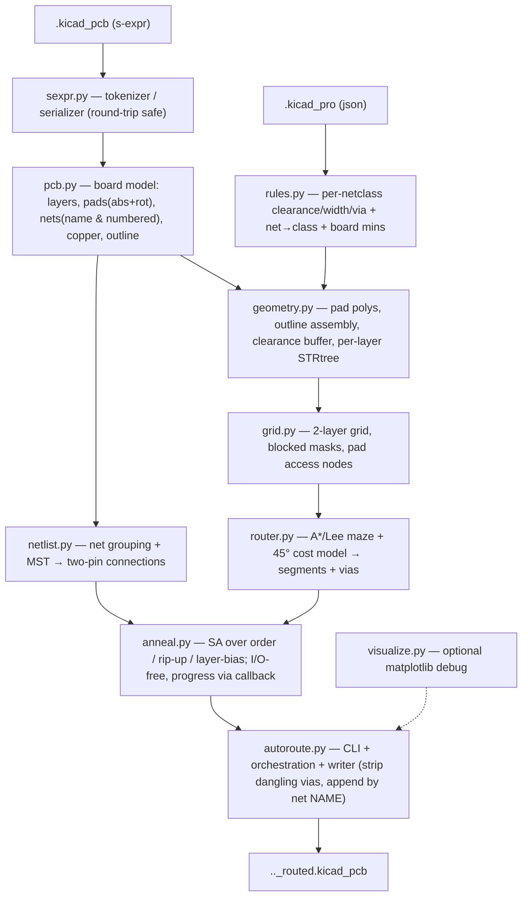

# PyAutoRoute — Simulated-Annealing Autorouter for 2-Layer KiCad PCBs

> **Status: ✅ Implemented (shipped in 0.1.0).** This is the *original design
> record* — the plan the project was built from. It is kept for context; the
> living reference is [`docs/architecture.md`](docs/architecture.md), and a plain
> explanation of the algorithms is in [`docs/algorithms.md`](docs/algorithms.md).
> Outstanding ideas live in [`docs/feature-suggestions.md`](docs/feature-suggestions.md);
> a TODO of items from *this* plan is at the bottom.
>
> *(Historical note: the venv paths and "confirm with user" wording below reflect
> the original development machine and are not current setup instructions.)*

## Context

The user wants a Python tool (running in the `tf` venv at `/Users/que/venvs/tf`,
Python 3.12) that **autoroutes a 2-layer KiCad PCB**: given a board with placed
footprints and assigned nets but no (or partial) tracks, produce a *copy* of the
PCB with candidate routing. Optimisation targets, in priority order:

1. **No DRC violations** — no collisions with other tracks, pads, footprints, or
   the board edge; honour clearance.
2. **Minimise total route length.**
3. **Use vias only where needed, minimise via count.**
4. **Two copper layers, prefer the front (F.Cu) layer.**
5. **Prefer 45° tracks over 90°.**

**Key requirement: the tool must generalise to *any* 2-layer KiCad board**, not
just the bundled test project. Everything (design rules, outline, layers, net
classes) is read from the project — nothing Test1-specific is hardcoded.

### Ground truth already established (test board `TestProjects/Test1/`)

- KiCad **10** format (`version 20260206`). Pads/vias reference nets **by name
  only** — there is *no* numeric net table (`grep` found 0 numbered `(net N ..)`
  declarations, 106 name refs). Older KiCad (6–9) uses a numbered net table; the
  parser must handle **both** for generality.
- `pcbnew` is **not** importable in `tf` (it is bound to KiCad's own Python 3.9).
  → We **parse the `.kicad_pcb` s-expression directly**, no `pcbnew` dependency.
- `tf` venv already has **numpy 1.26, scipy 1.17, shapely 2.1, matplotlib 3.10**.
  Missing: any s-expr lib, networkx. We need **no new heavy deps** (custom s-expr
  reader/writer; MST via `scipy.sparse.csgraph`; spatial index via shapely
  `STRtree`). Only `pytest` may need installing for tests.
- Design rules live in the **`.kicad_pro`** (`board.design_settings` +
  `net_settings.classes`): test board = track 0.2 mm, clearance 0.2 mm,
  via 0.6/0.3 mm, min copper→edge 0.5 mm, min hole-to-hole 0.25 mm, one net
  class "Default". General boards may have **multiple net classes** with per-net
  assignments — must be read generically.
- Board outline = a `gr_poly` on `Edge.Cuts` here, but general boards express the
  outline as `gr_line` segments / `gr_arc` / `gr_rect` / `gr_circle`. Outline
  builder must stitch arbitrary Edge.Cuts shapes into a polygon.
- 28 footprints, ~96–97 pads (SMD + thru-hole), 106 nets, **0 tracks**, plus
  **10 dangling free-vias** (net-tagged, no connected track) that will be
  stripped before routing. (Pad/net counts are descriptive — **do not hardcode
  them**; derive everything from the parsed board.)

## Approach (confirmed with user)

**Hybrid: grid maze router (A*) for per-net geometry + simulated annealing for
global optimisation.** This is how production routers (VPR / PathFinder) work and
gives DRC-clean output *by construction* while letting SA escape local minima.

```
Per two-pin connection:  A* / Lee maze search on a 2-layer routing grid
                         (clearance-aware; a layer change = a via)
                                   |
Global optimisation:     SIMULATED ANNEALING over
                           - net/connection routing ORDER (permutation)
                           - RIP-UP & REROUTE of worst / blocked nets
                           - per-net LAYER bias (prefer F.Cu)
                         Energy E = Σ wirelength
                                   + Wv·(#vias)
                                   + Wu·(#unrouted connections)
                                   + Wc·(#residual violations)
                         Accept worse moves with prob e^(−ΔE/T); geometric
                         cooling; keep best-seen solution.
```

45° preference is encoded in the A* cost model (below), not in SA.

## Module architecture

New package at `/Users/que/Documents/PyAutoRoute/pyautoroute/`.



| File | Responsibility |
|---|---|
| `sexpr.py` | Minimal, round-trip-safe KiCad s-expression tokenizer + serializer (nested lists of `Sym`/`str`/`float`/`int`). No external dep. Re-emits a file KiCad re-reads. |
| `pcb.py` | Load `.kicad_pcb` into a model: layers, footprints, pads (abs position via footprint+pad transform/rotation), nets (name-based **and** numbered formats), existing tracks/vias/zones, Edge.Cuts outline. Writer: clone original token tree, strip dangling vias, append new `(segment …)`/`(via …)` by net **name**, write to a new file. |
| `rules.py` | Parse `.kicad_pro`: per-net-class clearance / track_width / via_diameter / via_drill, the net→class mapping (incl. pattern assignments), board min rules (edge clearance, hole-to-hole). Fallback defaults if `.kicad_pro` missing. |
| `geometry.py` | Pad-shape → shapely polygon (roundrect/rect/circle/oval/trapezoid/custom + rotation); outline assembly from Edge.Cuts; clearance inflation (`buffer`); per-layer obstacle `STRtree` index. |
| `grid.py` | 2-layer uniform routing grid over the inset board polygon; 8-neighbour connectivity; rasterise inflated obstacles → blocked mask per layer; map pad polygons → valid access nodes. |
| `router.py` | A*/Lee single-connection maze router on the grid with the cost model below; emits a node path; converts collinear runs → KiCad segments + vias at layer changes. |
| `netlist.py` | Group pads by net; drop nets matching `--exclude-net` (their pads still count as obstacles, just no connections generated); per-net MST over pad centroids (`scipy.sparse.csgraph.minimum_spanning_tree`) → set of two-pin connections (rats-nest decomposition); account for pads already joined by existing copper. |
| `anneal.py` | SA engine: state (order + per-net layer bias), neighbour moves, energy, Metropolis acceptance, geometric cooling, time/iteration budget, best-solution tracking; incremental rip-up/reroute of only affected nets. |
| `autoroute.py` | Orchestration + CLI entry point. |
| `visualize.py` | (optional) matplotlib debug render of layers/obstacles/routes. |
| `tests/` | round-trip parser test, geometry/transform tests, small synthetic routing test, end-to-end Test1 run. |

**Testability boundary:** every module above is plain Python (+ numpy/scipy/
shapely from `tf`) and is unit-testable directly in the `tf` venv — there is no
`pcbnew` dependency anywhere. The *only* steps that need a full KiCad install are
`kicad-cli pcb drc` and eyeballing the result in the KiCad GUI.

## Algorithm detail

**A\* cost model (per grid step):**
- straight step = `g`; diagonal step = `√2·g` (true length, so a 45° move beats a
  90° staircase: 1.414g < 2g).
- **bend penalty** added on direction change, with a larger penalty for 90°
  bends than 45° → diagonal routing preferred (requirement #5).
- **via cost** `Wv` on layer change (large, to minimise vias, req #3).
- **layer cost**: small per-step penalty on B.Cu so F.Cu is preferred (req #4).
- heuristic = octile distance to target (admissible for 8-neighbour).

**Blocked / clearance (req #1):** a node on layer L is blocked if a disk of
radius `track_width/2 + clearance` (for that net's class) around it intersects any
other-net obstacle on L (pad, existing track, zone, board-edge inset by
`min_copper_edge_clearance`). Obstacles rasterised to a per-layer mask for speed;
same-net pads/tracks are *not* obstacles (they're connection targets). A via also
requires the via pad clear on **both** layers plus `min_hole_to_hole` from other
vias/TH holes.

**Pad access:** grid nodes whose cell lies inside a pad's polygon (on the pad's
layer; TH pads = both layers) are valid A* start/goal nodes; the resulting track
terminates inside the pad so KiCad infers the connection.

**SA loop:** init order = greedy (shortest / most-constrained connection first).
Each iteration applies one move (swap two connections, reverse a sub-sequence,
rip-up+reroute the most-congested net, flip a net's preferred layer), reroutes
only the affected connections, computes ΔE, accepts via Metropolis. Cool T
geometrically; stop on iteration/time budget; return best-seen routing.

## CLI

```
python -m pyautoroute.autoroute INPUT.kicad_pcb \
    [--pro PROJECT.kicad_pro]   # default: sibling .kicad_pro
    [-o OUTPUT.kicad_pcb]       # default: INPUT_routed.kicad_pcb
    [--grid 0.1]                # grid pitch in mm (default derived from rules)
    [--iters N | --time SECONDS]
    [--exclude-net NAME ...]    # nets to leave un-routed (repeatable; glob
                                #   patterns allowed, e.g. "GND" or "/PWR*")
    [--seed S] [--via-weight W] [--debug-plot]
    [--quiet]                   # suppress the live text progress display
```
Run on the test board produces `TestProjects/Test1/Test1_routed.kicad_pcb`
(input never overwritten).

> **Optional packaging.** A minimal `pyproject.toml` (`requires-python>=3.10`,
> console script `pyautoroute = pyautoroute.autoroute:main`, `[dev]` extra =
> `pytest`, `[viz]` extra = `matplotlib`) makes `pip install -e .` and a bare
> `pyautoroute …` command available. The heavy deps (numpy/scipy/shapely) already
> live in `tf`, so this is convenience only — flagged as optional, not required.

### Progress display

By default the tool prints a **live text-based progress display** to the
terminal (stderr) so a long route is observable. It updates in place (single
re-written line / small block via `\r`, falling back to plain line-by-line
output when stdout is not a TTY) and shows:

- phase (parsing → grid build → initial route → annealing → writing);
- during annealing: iteration `i/N` (or elapsed/​budget seconds), current
  temperature `T`, current energy `E`, best energy so far, and the
  routed / unrouted connection counts;
- a final summary line (see Metrics report under Verification).

`--quiet` disables it (only the final summary is printed). Implemented in
`autoroute.py` with a small reporter helper that `anneal.py` calls via a
callback each accepted iteration — the SA engine stays I/O-free.

## Implementation phases

1. **`sexpr.py` + round-trip test** — parse Test1, re-serialize unchanged, confirm
   byte/semantic equivalence and that `kicad-cli pcb drc` still loads it.
2. **`rules.py` + `pcb.py` model** — extract layers, pads (abs+rotation), nets
   (both formats), outline, existing copper; unit-test pad transforms.
3. **`geometry.py`** — pad polygons, outline assembly, obstacle `STRtree`.
4. **`grid.py`** — grid + per-layer blocked masks + pad access nodes.
5. **`router.py`** — A* single-net router with the cost model; path→segments/vias.
6. **`netlist.py`** — net grouping + MST connection decomposition (skip
   `--exclude-net`).
   → **Milestone A — greedy, DRC-clean route.** Wire phases 1–6 with a simple
   greedy connection order + the writer, producing a `Test1_routed.kicad_pcb`
   that is DRC-clean *by construction* (some nets may be left unrouted). This is
   a shippable checkpoint before any SA work.
7. **`anneal.py`** — SA engine wrapping sequential routing.
   → **Milestone B — optimised route.** SA improves length / via count / routed
   fraction over the Milestone-A baseline.
8. **`autoroute.py`** — wire it together + CLI + writer (strip dangling vias,
   append routing by net name) + progress display.
9. **End-to-end** on Test1; tune weights/grid; optional `visualize.py`.

## Verification

- **Round-trip test**: parse + re-write Test1 unmodified → KiCad opens it; diff is
  empty/semantically identical.
- **In-repo self-check (no `kicad-cli` needed)**: re-parse our own
  `Test1_routed.kicad_pcb` and assert via shapely that no routed segment/via
  violates track-, pad-, via-, or board-edge clearance for its net class. This is
  the fast, CI-able correctness gate since it runs entirely in `tf`.
- **End-to-end**: route Test1 → `Test1_routed.kicad_pcb`; validate with
  `kicad-cli pcb drc` (check availability) on `Test1_routed.kicad_pcb` →
  **0 clearance / 0 unconnected** errors (or a report of residuals). Open in
  KiCad to eyeball.
- **Metrics report**: total wirelength, via count, % connections routed, runtime —
  printed at end of run.
- **Generality smoke test**: run on a second, structurally different 2-layer board
  (e.g. one with `gr_line` outline + multiple net classes) to confirm nothing is
  Test1-specific. (User to point at one, or synthesise a minimal board.)
- `pytest tests/` green (install pytest into `tf` if absent).

## Assumptions / decisions (flag if any are wrong)

- Output to a **new** `_routed.kicad_pcb`; original untouched.
- The **10 dangling free-vias are stripped** before routing (they're artifacts).
- Route **all** nets (including power/GND); no copper-pour generation in v1 —
  existing zones are treated as obstacles + same-net connectivity. Pour-aware
  routing is a noted future extension.
- "Two layers" = the two signal copper layers in the stack (F.Cu, B.Cu),
  read from the `(layers …)` block; front = preferred.
- DRC-clean **by construction**; nets that cannot be routed are left unrouted and
  **reported** rather than drawn with violations.
- `--exclude-net` nets are **never routed** but their existing pads/copper are
  still treated as obstacles (so routed nets keep clear of them); any existing
  tracks on an excluded net are preserved untouched. Reported separately from
  "failed to route" so the user can tell intentional skips from failures.
- **Nothing Test1-specific is hardcoded** — pad/net/footprint counts, the outline
  primitive used, and the net-class set are all derived from the parsed board.
- No new heavy dependencies; only `pytest` may be installed into `tf` for tests.

## TODO / remaining from this plan

All nine implementation phases above shipped; phases 1–8 are the modules
described in `docs/architecture.md`. The only deferred items noted in this plan:

- [ ] **Pour-aware routing.** v1 treats copper zones as obstacles (and, since
      0.20.0, auto-excludes filled pours and refills via `kicad-cli`); the router
      still does not *generate* pours. (Noted future extension, line ~224.)
- [ ] **Per-net-class clearance masks.** The grid uses one global worst-case
      clearance margin across all net classes — conservative on mixed-rule boards.
      (Tracked in `docs/feature-suggestions.md`.)

Everything else here is done. Newer work (placement, GUI, tuning, performance)
has its own plan docs; see `CHANGES.md` for the version-by-version history.
