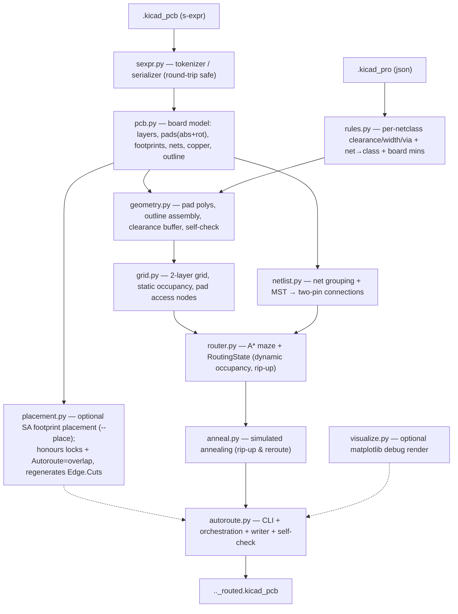

# PyAutoRoute — architecture & internals

Developer-facing notes on how the autorouter is put together: the data flow, each
module's job, the algorithms, and the non-obvious invariants that make the output
DRC-clean. For user-facing usage see the top-level `README.md`.

## API documentation

Per-module HTML API docs (generated from the module docstrings) live in
[`docs/api/`](api/index.html) — open `docs/api/index.html` in a browser.
Regenerate them after changing docstrings with:

```bash
pip install -e ".[docs]"          # installs pdoc
pdoc pyautoroute -o docs/api
```

## Pipeline



Everything is plain Python plus numpy/scipy/shapely — there is **no `pcbnew`
dependency**. The only step that needs a full KiCad install is the *optional*
`kicad-cli pcb drc` cross-check; PyAutoRoute's own `geometry.clearance_violations`
provides an equivalent in-repo gate.

## Modules

### `sexpr.py` — round-trip-safe s-expressions
A tokenizer + recursive-descent parser producing nested `SList`/`Atom` trees, and
a serializer that reproduces KiCad's formatting.

- **Atoms keep their exact source text** (`Atom.raw`), so numbers and strings
  never get reformatted.
- **`SList` records its source span.** When serializing, an unmodified subtree is
  emitted **verbatim** from the original bytes. This sidesteps KiCad's per-object
  pretty-printing quirks (e.g. wrapping long `(pins ...)` lists, packing
  `(pts ...)` onto one line) and guarantees a **byte-identical round-trip** for
  anything we don't touch. Nodes we build ourselves have no span and use the
  generic formatter (atoms-only lists on one line; child-bearing lists as
  indented blocks; `pts` packed).

### `rules.py` — design rules from `.kicad_pro`
Parses `net_settings.classes` and `board.design_settings.rules` into a
`DesignRules` with per-net-class clearance / track width / via geometry, plus the
net→class resolver (explicit `netclass_assignments`, then glob `netclass_patterns`,
then `Default`). Effective values are floored by the board minimums. Falls back to
KiCad defaults when no project file is present. Handles both name-only nets
(KiCad 10) and numbered net tables (KiCad 6–9) downstream.

### `pcb.py` — board model + writer
Loads the board into a `Board`: copper layer stack, every `Pad` with **absolute**
position/rotation/shape/layers/net, the per-footprint grouping, free (dangling)
vias, existing segments and zones (with a `fill_enabled` flag for copper fills), and the Edge.Cuts outline shapes. Two file
conventions are handled transparently:

- **Net references** — `(net "GND")` (name-only) and `(net 3 "GND")` /
  `(net 3)` (numbered). The board's style is detected; the writer emits the same
  style.

A **`Footprint`** records each footprint's origin/rotation, its lock state (a bare
`locked` atom or `(locked yes)`), the `Autoroute=overlap` property flag, and each
pad's *local* offset/angle. This is what the optional placement pass moves:
`Footprint.sync_pads` recomputes the pads' absolute coordinates from a new pose,
and `Board.footprints` defaults to empty so callers that build a `Board` directly
are unaffected.

The **writer** (`write_board`) clones the parsed tree, drops the free vias, and
appends freshly-built `(segment …)` / `(via …)` nodes. Because untouched children
keep their source spans, the diff against the input is limited to the routing
edits. When placement has run, two helpers prepare the tree first:
`apply_placement` pushes the moved poses into the pads and replaces `Board.outline`
with a margin-grown bounding rectangle, and `sync_tree_from_placement` rewrites each
moved footprint's `(at …)` node (clearing its span so only that line changes) and
swaps the Edge.Cuts graphics for a single generated `gr_rect`. For a footprint that was **rotated**, `_rotate_pad_nodes` adds the rotation delta
to each pad's `(at …)` angle — KiCad stores pad angles *absolutely*, so without
this a rotated footprint's pads would reload in their old orientation, mis-orienting
rectangular pads and failing DRC. The symmetric `_rotate_text_nodes` does the same
for `fp_text` and `property` `(at …)` angles so silkscreen labels also rotate with
the footprint in the written file.

### `geometry.py` — shapes & self-check
shapely geometry for pads (rect / roundrect / circle / oval / trapezoid; custom
falls back to bounding box), tracks, vias, and the board outline (stitching
`gr_line` / `gr_arc` / `gr_rect` / `gr_circle` / `gr_poly` via `polygonize`).
Loose edge segments are noded with `unary_union` before `polygonize`, so
outlines whose edges overlap or are collinear-redundant (rather than meeting at
a shared vertex — common in hand-edited KiCad boards) still close into a polygon.
`clearance_violations(board, rules)` is the **in-repo DRC self-check**: it
re-derives copper per layer and reports any different-net pair closer than the
required clearance, using an STRtree.

### `grid.py` — static occupancy
A uniform node grid over the board's bounding box. `owner[layer, row, col]` holds
*static* occupancy:

- `FREE (-1)` — usable by any net;
- `BLOCKED (-2)` — board edge, no-net copper, or copper of two different nets;
- `net id` — copper of exactly one net (usable only by that net).

Built in three passes: edge mask (nodes outside the inset outline → BLOCKED),
obstacle owners (pads/segments/vias/zones inflated by the clearance margin), and a
**pad-interior override** (see invariants). Also provides coordinate conversion
and `pad_access_nodes` (grid nodes inside a pad polygon, the A* start/goal set).

### `router.py` — A* + dynamic occupancy
- **`RoutingState`** layers *dynamic* routed copper on top of the grid's static
  occupancy. It is keyed **per connection** (`cover[node] = {conn_idx}`,
  `conn_net[idx]`), so two connections of the same net never block each other and
  any single connection can be ripped up exactly — the foundation for annealing.
- **`astar`** searches states `(layer, col, row, incoming_dir)` over the cost
  model below, with octile heuristic to the nearest target.
- **`route_all`** routes a list of connections in a given order, committing each
  success.
- **`path_to_nodes`** converts a node path into KiCad segments (collinear runs
  merged) + vias (at layer changes), then **stubs each end to the pad anchor**
  (`_centre_stub`): the A* path terminates on whichever pad-access grid node the
  search preferred, so a short segment carries that endpoint to the pad centre
  (`Pad.cx/cy`, threaded through on `RouteResult.src_xy/dst_xy`). Both the node and
  the centre lie inside the pad, so the stub stays within the pad's own copper and
  introduces no clearance violation — but the track now ends exactly on the pad
  anchor, so KiCad keeps it attached when the footprint is moved. A stub shorter
  than `_STUB_EPS` (the centre already lands on a node) is dropped.

### `netlist.py` — rats-nest
Groups pads by net, drops `--exclude-net` matches, and reduces each multi-pad net
to two-pin connections via a **minimum spanning tree** over pad centroids
(`scipy.sparse.csgraph.minimum_spanning_tree`). `greedy_order` sorts connections
shortest-first for the initial routing pass.

### `anneal.py` — simulated annealing
Incremental rip-up & reroute over an already-committed routing. Moves: rip a
connection (failed *or* routed) plus its nearest neighbours and reroute the freed
cluster, swap the routing order of two, or reroute one. The cluster rip-and-reroute
is the move that shortens an already-complete board — freeing a local group and
re-routing it in a fresh order lets a connection take a more direct path than it
won in the sequential greedy pass (a plain single-connection reroute on unchanged
occupancy just returns the same path). Energy
`E = wirelength + via_weight·#vias + unrouted_weight·#unrouted`. Metropolis
acceptance under a geometric cooling schedule (`t_start` → `t_end`); the best-seen
routing is kept. Because the router is DRC-clean by construction, there is no
violation term. The energy/schedule knobs exposed on the CLI are `--via-weight`,
`--unrouted-weight`, and `--anneal-temps START END`; `rip_neighbours` and the
A* bend/via cost weights remain `AnnealParams`/`RouteParams` defaults.
Optional **stall detection** (`AnnealParams.stall_ratio`/`stall_patience`, off by
default) breaks the loop early when the windowed acceptance ratio stays below
`stall_ratio` for `stall_patience` consecutive accept-windows, still returning the
best routing.

### `placement.py` — optional footprint placement
The placement analogue of `anneal.py`, enabled by `--place`. Simulated annealing
over **footprint poses** (not tracks): moves are translate (a `--place-step`,
temperature-scaled random step), rotate (`--place-rotate`: `ortho` ±90°/180°,
`free` any angle, or `none`), or swap two footprints' origins, with Metropolis
acceptance under a geometric `--place-temps` (`t_start → t_end`) schedule and the
best-seen placement kept. A recent-window **acceptance ratio** is tracked (as in
`anneal`) and reported via the progress callback; `PlaceResult` also carries the
energy breakdown (`final_ratsnest`/`final_overlap`/`final_bbox`) at the best
placement. Energy
`E = ratsnest + overlap_weight·overlap_area + compact_weight·bbox_area`:

- **ratsnest** — total MST length over pad centroids, reusing `netlist`
  (`build_connections` + `Connection.est_length`). The connection topology is
  fixed for the run, so it is built once and only the lengths of connections
  incident on a moved footprint are recomputed per move (see incremental energy
  below).
- **overlap_area** — pairwise intersection of footprint body boxes via a shapely
  `STRtree` (as in `geometry.clearance_violations`). Each box is grown by half of
  `--place-buffer` per side, so a pair counts as overlapping until its gap exceeds
  the buffer; the optimiser then keeps footprints at least `buffer` apart, leaving
  room for routing clearance (the default is derived from the design-rule
  clearance). A pair where either footprint
  is `overlap_ok` (the `Autoroute=overlap` property) contributes only its
  *pad-vs-pad* overlap, not body overlap — the shield-over-board case. **Locked**
  footprints are immovable obstacles included in the overlap term.
- **bbox_area** — area of the bounding box of all footprints; compaction emerges
  from this term under cooling, with no separate phase.

**Incremental energy.** The energy is cached and updated per move rather than
recomputed wholesale: `_rebuild_cache` does the one-time full pass (and runs again
only at the final report), while `_move_delta` updates just the parts a move can
change — the lengths of connections incident on the moved footprint(s), those
footprints' overlap contributions (against neighbours and fixed silk text), and
the layout bbox from cached per-box bounds. A rejected move restores the disturbed
cache entries. This turns each iteration from O(P² + N·log N) into roughly
O(deg + neighbours). Optional **stall detection**
(`PlaceParams.stall_ratio`/`stall_patience`, off by default) mirrors `anneal`'s.

Each move keeps the moved footprint's pad coordinates in sync
(`Footprint.sync_pads`) so the energy geometry stays consistent.

**Recentering (anti-drift).** Every energy term depends only on the footprints'
*relative* poses, so the energy is **translation-invariant**: with nothing locked,
the cluster random-walks during annealing and drifts off the board origin — the
more iterations run, the further it migrates (this became visible once the Cython
core let many more iterations run). Before returning, `place()` calls `recenter`,
which shifts every movable footprint by one rigid offset so their centroid returns
to where it started. Because it is a pure translation it leaves every energy term
(and the `PlaceResult`) exactly unchanged. It is a no-op when any footprint is
locked: locked footprints anchor the layout in absolute coordinates, so there is no
drift to undo and shifting the movable group would only break alignment with them.

`place()` leaves
the board at the best placement; `autoroute` then calls `pcb.apply_placement` (pads
+ new outline) before building the grid, and `pcb.sync_tree_from_placement` before
the write. The whole stage is transparent to the router, which already consumes
`Board.pads` and `Board.outline`. CLI knobs: `--place-iters`/`--place-time`
(budget), `--place-temps` (schedule), `--place-step`, `--place-rotate`,
`--place-margin`, `--place-buffer` (inter-footprint keep-out),
`--place-overlap-weight`, `--place-compact-weight`; `--seed` is shared.

**Silkscreen text in body boxes.** `_fp_silk_text_extents` pre-computes a list of
`(local_x, local_y, half_diag)` for each visible, non-hidden silkscreen text item
(`property "Reference"` / `"Value"` and `fp_text` on `F.SilkS` / `B.SilkS`)
in a footprint. `_fp_box` transforms these local positions to board coordinates
using the footprint's current pose and extends the AABB to cover them (using a
rotation-invariant circular half-diagonal estimate). This means the overlap penalty
also pushes *text labels* apart — footprints won't be placed so close that their
Reference or Value silkscreen text overlaps a neighbour.

**Board-level silkscreen text.** Top-level `gr_text` items (connector pin labels, a
title block, "Bus Indicator" — silkscreen annotations that aren't part of any
footprint) are not in `Board.footprints`, so the placer would otherwise drop a
footprint straight on top of them. `_board_silk_text_boxes` scans the board tree
once for each visible, non-hidden silk `gr_text`, estimating its extent the same way
as footprint text (centre + half-diagonal, honouring the `at` angle and `justify`
anchor). These become *static* keep-out boxes (an `STRtree`), and
`_fixed_text_overlap` adds each footprint's intersection with them into the same
`overlap_weight` term — so footprints are pushed clear of fixed silkscreen text.
`overlap_ok` footprints (meant to sit over the board) are exempt.

### `autoroute.py` — CLI & orchestration
**Settings file.** `--config FILE` is resolved by a throwaway pre-parser that reads
only `--config`; its `[pyautoroute]` values are coerced to each option's type
(`load_config`, keyed by argparse `dest`) and pushed in via `parser.set_defaults`,
so a value given on the command line still wins — precedence is defaults < config <
CLI, for free. `--write-config` dumps the effective namespace back to INI
(`write_config`) and exits. List/2-tuple options are comma-separated; flags are
`true`/`false`.

**Best-of-N.** `--runs N` repeats the route + anneal loop N times (seed stepped per
run, fresh `RoutingState` over the one deterministic `Grid`) and keeps the
lowest-energy routing (scored by `anneal._energy`); without annealing the greedy
route is deterministic so N collapses to 1. `--place-runs N` is the placement
analogue, implemented in `placement.place(runs=N)` (each run restarts from the
original poses, the best placement is kept).

Argument parsing, the parse → (place) → grid → route → (anneal) → write flow, the live
text progress `Reporter` (single-line `\r` updates on a TTY, line-by-line
otherwise, silent under `--quiet`), the metrics report, and the post-write
self-check. `default_output` names the file for the run — `_routed`,
`_placed_routed` (`--place`), or `_placed` (`--place-only`). `--place-only` runs
the placement pass then writes the placed board and returns *before* the
netlist/grid/route phases; `_finish` (debug plot + timing + log close) and the
self-check are shared with the routing path. Exit code 2 if the self-check finds a
violation. The version
(`pyautoroute.__version__`, read from the installed package metadata) is printed
on startup and written to the `--log` header; `--version` prints it and exits.

`coarse_grid_note` prints (and logs) a heads-up when the effective `--grid`
pitch exceeds ~2× the rules-derived pitch (`default_pitch` = `track/2 +
clearance`): clearance is enforced discretely on the grid, so a coarse grid
can't fit a node in the gap beside a pad and forces a via under it where a finer
grid would route on a single layer.

Two diagnostic options hook into this flow:
- **`--snapshots N`** writes `N` intermediate routed boards to a `snapshots/`
  subdir during annealing. The annealer fires an `on_snapshot(k, n, results)`
  callback as it crosses each `k/N` of its progress (by iteration for `--iters`,
  by wall-clock for `--time`); the run() callback serialises the current routing
  to `snapshots/<input>_anneal_<k>of<N>.kicad_pcb`. The final snapshot captures
  the best routing. No-op (with a note) if neither `--iters` nor `--time` is set.
- **`--log [FILE]`** tees a verbose plain-text log: a parameter/board dump up
  front, a throttled trace of routing and annealing progress, snapshot events,
  and the final metrics — all timestamped. The `Reporter` owns the file and
  writes regardless of `--quiet`. Bare `--log` uses `<output>.log`.

### `visualize.py` — board rendering
`draw_board(ax, board, *, results=None, grid=None, title=None)` paints the outline,
pads, tracks, and vias onto a caller-supplied matplotlib Axes (clearing it first, so
it can refresh a live view). `render()` is a thin Agg wrapper around it for the
`--debug-plot` PNG; the planned GUI canvas embeds a Figure and calls `draw_board`
directly. Passing `results` (+ `grid`) draws an in-progress routing straight from the
router's node paths, before any segments are written to the board.

### `tune.py` — parameter sweep & scoring
Scores a routing with a single objective
(`unrouted_weight·unrouted + length + via_weight·vias + time_weight·runtime`,
lower better — the annealer's energy plus a runtime tiebreaker) and sweeps the
critical parameters to find the best setting. `evaluate` routes a board under one
`Config` + seed and measures it; `sweep`/`sweep_board` run the search-space
configs over several seeds and score each by the **median** (so a lucky seed
doesn't win), reusing one parsed board and one grid per pitch; `best_config` picks
the lowest. The `pyautoroute-tune` CLI prints a per-board markdown report. `--auto`
(in `autoroute.py`) reuses `sweep`/`best_config` as a quick probe on the board (a
small `--auto-probe-time` budget), then sets `--grid`/`--via-weight` — after asking
to confirm on a TTY (`--auto-yes` skips). See [`tuning.md`](tuning.md) for the
method and roadmap. `tune` imports `default_pitch` from `autoroute`, so `autoroute`
imports `tune` lazily (inside `--auto`) to avoid a cycle.

### `fixup.py` — board fixup CLI
`pyautoroute-fix` corrects footprint-level issues that don't affect routing but
matter for fabrication.  Currently one operation:

- **`--values`** — calls `pcb.fix_value_layers(board)`, which walks every
  `(property "Value" ...)` (KiCad 7+) and `(fp_text value ...)` (KiCad 6)
  node in the board tree.  For each node not already on a silkscreen layer
  the `(layer ...)` atom is replaced with the front or back silk name (`F.SilkS`
  / `B.SilkS`, discovered from the board's own layer table) that matches the
  footprint's side.  Span invalidation on the changed `layer`, `property`,
  and `footprint` nodes ensures `write_board` re-serializes only those subtrees.

`--dry-run` reports what would change without writing.  `-o OUT` writes to a
separate output path instead of overwriting the input.

### `pyautoroute.sh` — helper menu
A repo-root Bash script offering a menu of common tasks (install, regenerate API
docs via the `pdoc` recipe, run the short/long test suite, route a test board,
write a settings file, clean generated outputs). Each action echoes the command it
runs; the interpreter is overridable with `PYTHON=`.

## Coordinate system & the pad-angle gotcha

All geometry is in **KiCad board coordinates**: millimetres, **Y pointing down**.

- **Pad position** uses KiCad's `RotatePoint` convention to rotate the pad's local
  offset by the footprint orientation, then translate:
  `x' = px·cos(fa) + py·sin(fa)`, `y' = −px·sin(fa) + py·cos(fa)`
  (see `pcb.rotate`). shapely rotations use `affinity.rotate(geom, −angle)` to
  match.
- **Pad orientation** — KiCad stores the pad's `(at x y angle)` angle
  **absolutely**: it already includes the footprint rotation. So `pad.angle` is the
  stored value, **not** `footprint_angle + pad_angle`. Getting this wrong silently
  transposes the width/height of rotated rectangular pads and produces phantom
  "unconnected" reports (the track lands just outside the real pad). Verified
  against `kicad-cli` connectivity on a `-90°` footprint with `270°` pads.

## Occupancy & the "DRC-clean by construction" invariant

Clearance is enforced discretely on the grid, not checked after the fact.

- **Obstacle inflation.** Each obstacle is grown by
  `margin = hypot(max_track/2 + max_clearance, safety)` before marking grid
  owners, where `safety = pitch · √2 / 2`. The `max_track/2` term is the *routing*
  track's half-width (a forbidden node is for a track centre, so the centre must
  clear by the routing track's half-width plus clearance), and `max_*` are taken
  across net classes so the single global margin is safe on multi-class boards.
  The safety term covers grid discretisation: a point on a track segment between
  two free node-centres can sit up to half a diagonal (`safety`) from the nearer
  node. The required keep-out `clear = max_track/2 + max_clearance` and that offset
  are **perpendicular in the worst case** (obstacle abeam the segment midpoint),
  so they combine *in quadrature* — `hypot(clear, safety)`, not `clear + safety`.
  A node kept that far from an obstacle guarantees the whole segment stays `clear`
  away; summing the two terms linearly instead is safe but over-inflates by up to
  `safety`, which can wall off dense through-hole clusters that are in fact
  routable.
- **Committed copper is inflated the same way.** A routed track/via is treated
  like a pad obstacle: its copper is grown by the full `margin` (i.e. with the
  `max_track/2` term inside the quadrature, not `hypot(max_clearance, safety)`)
  when marked owned. The routing-track half-width term is
  essential here — on a multi-class board a later wide (e.g. 0.6 mm) track would
  otherwise encroach on an earlier track's clearance. (On uniform single-class
  boards the safety slack masked this; a wide-track multi-class board exposed it.)
- **Vias clear more area than tracks.** A via uses
  `via_margin = hypot(via_diameter/2 + clearance, safety)` (same quadrature
  combination; the board edge keep-out `edge_margin` is built the same way).
  `can_via` checks the whole
  via-clearance disk is free on **both** layers (a stencil of node offsets), and
  committing a via marks that disk on every layer. Omitting this was the original
  source of shorts/hole-clearance violations.
- **Pad-interior override.** Nodes strictly inside a *real* pad polygon are forced
  to that pad's net, overriding any foreign clearance zone. A track may always
  enter its own pad (the pad copper is already there, so it adds no new clearance
  violation), while the inflated zone *outside* the pad still keeps other nets
  clear of it. Without this, tightly-packed pads (e.g. a DIP switch flanked by
  other nets) have their interiors flooded by neighbours' clearance and the router
  stops one cell short, producing unconnected tracks.

Net result: a route returned by A* over this occupancy is clearance-legal as a
continuous shape, so the written board passes DRC. Connections that can't be
routed are dropped and reported, never drawn with violations.

## A\* cost model

Per step (all in mm so length dominates):

- straight = `pitch`; diagonal = `pitch·√2` (true length, so a 45° run beats a 90° staircase);
- **bend penalty** on direction change, increasing with the turn angle (`bend45 < bend90 < bend135 < bend180`) so diagonal routing is preferred;
- **via cost** (`via_cost`, mm-equivalent) on a layer change;
- **back-layer penalty** per step on a non-front layer so F.Cu wins ties;
- heuristic = octile distance to the nearest target × pitch (admissible — every extra term is non-negative).

State includes the incoming direction so bend penalties can be applied; diagonal
moves are forbidden from cutting a blocked corner.

## Simulated annealing details

- **State** = the set of committed connection routes (in `RoutingState`).
- **Move** = rip up a small set of connections and reroute them, optionally in a
  new relative order. On rejection the move is reverted by ripping the new routes
  and re-committing the snapshots (committing is idempotent given a path).
- **Acceptance** = Metropolis: accept if `ΔE ≤ 0`, else with probability
  `exp(−ΔE/T)`. `T` follows a geometric schedule from `t_start` to `t_end`.
- **Budget** = `--iters` or `--time` (else a small default); the best-seen routing
  is returned regardless of where the walk ends.
- Per-route A* is expansion-capped during annealing so a hard net fails fast
  instead of exploring forever.
- **Cancellation** = an optional `threading.Event` passed to `anneal`/`placement`;
  when set, the loop stops early and returns the best-so-far. This backs a GUI Stop
  button (the SA runs on a worker thread; see `docs/gui-plan.md`).

## Testing

`pytest` (unit, integration, and end-to-end tests). Highlights:

- `test_sexpr` — byte-identical round-trip + structural faithfulness of the generic formatter.
- `test_pcb` — pad absolute position/rotation, both net formats, writer no-op byte-identity, free-via stripping, segment append.
- `test_rules`, `test_geometry`, `test_grid`, `test_netlist`, `test_router` — per-module behaviour (occupancy semantics, via crossing, diagonal preference, exact rip-up).
- `test_anneal` — best energy never worsens; routing stays clean after annealing.
- `test_placement` — placement energy never worsens; locked footprints stay put; bodies separate while `Autoroute=overlap` parts may overlap (pads kept apart); lock/property parsing and the footprint-`(at)` + Edge.Cuts tree rewrite round-trip; silkscreen text extents returned by `_fp_silk_text_extents` and included in `_fp_box`.
- `test_endtoend` — routes a synthetic board with a **`gr_line` outline** (generality) and `--exclude-net`, asserting zero clearance violations via the self-check.
- `test_boards` — parametrized over every board in `TestProjects/` (ids `Test1`..`Test5`; hidden stray files like `.kicad_pcb.kicad_pcb` are skipped): parse, round-trip, writer no-op, outline/pads-inside, and a routing self-check. Routing the large boards (>30 pads) is skipped by default and enabled with `pytest --slow` (defined in `conftest.py`).

The repo also carries `TestProjects/Test1/` (a real KiCad 10 board) used by the
integration tests and validated end-to-end with `kicad-cli pcb drc`.

## Known limitations / future work

- **Two layers only.** The stack is read generically but routing assumes F.Cu/B.Cu.
- **Copper fills.** Zones with `(fill yes …)` are auto-detected: their net is excluded from routing and placement, and the zone polygon is skipped in `board_obstacles` (it is not a routing obstacle). After writing the output board, `pcb.try_refill_zones` invokes `kicad-cli pcb drc --refill-zones --save-board` to regenerate the pour; if `kicad-cli` is not available the user is prompted to refill manually in KiCad. Zones without `fill yes` (e.g. keepouts, teardrops) are still treated as obstacles.
- **Custom pads** are approximated by their bounding box.
- **Conservative clearance for mixed net-class boards.** The single global inflation margin uses the maximum track/clearance across classes; exact per-net masks would route denser mixed-rule boards.
- **Hole-to-hole** is approximated by copper clearance rather than checked explicitly.
- **Performance.** A* is unbounded in search area, so a few long nets dominate runtime. Bounding the search region (a slack box around the connection) is the highest-value next optimisation.
