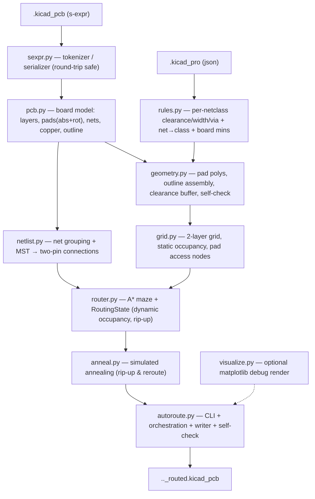

# PyAutoRoute — architecture & internals

Developer-facing notes on how the autorouter is put together: the data flow, each
module's job, the algorithms, and the non-obvious invariants that make the output
DRC-clean. For user-facing usage see the top-level `README.md`.

## API documentation

Per-module HTML API docs (generated from the module docstrings) live in
[`docs/api/`](api/index.html) — open `docs/api/index.html` in a browser.
Regenerate them after changing docstrings with:

```bash
pip install -e ".[docs]"          # installs pdoc
pdoc pyautoroute -o docs/api
```

## Pipeline



Everything is plain Python plus numpy/scipy/shapely — there is **no `pcbnew`
dependency**. The only step that needs a full KiCad install is the *optional*
`kicad-cli pcb drc` cross-check; PyAutoRoute's own `geometry.clearance_violations`
provides an equivalent in-repo gate.

## Modules

### `sexpr.py` — round-trip-safe s-expressions
A tokenizer + recursive-descent parser producing nested `SList`/`Atom` trees, and
a serializer that reproduces KiCad's formatting.

- **Atoms keep their exact source text** (`Atom.raw`), so numbers and strings
  never get reformatted.
- **`SList` records its source span.** When serializing, an unmodified subtree is
  emitted **verbatim** from the original bytes. This sidesteps KiCad's per-object
  pretty-printing quirks (e.g. wrapping long `(pins ...)` lists, packing
  `(pts ...)` onto one line) and guarantees a **byte-identical round-trip** for
  anything we don't touch. Nodes we build ourselves have no span and use the
  generic formatter (atoms-only lists on one line; child-bearing lists as
  indented blocks; `pts` packed).

### `rules.py` — design rules from `.kicad_pro`
Parses `net_settings.classes` and `board.design_settings.rules` into a
`DesignRules` with per-net-class clearance / track width / via geometry, plus the
net→class resolver (explicit `netclass_assignments`, then glob `netclass_patterns`,
then `Default`). Effective values are floored by the board minimums. Falls back to
KiCad defaults when no project file is present. Handles both name-only nets
(KiCad 10) and numbered net tables (KiCad 6–9) downstream.

### `pcb.py` — board model + writer
Loads the board into a `Board`: copper layer stack, every `Pad` with **absolute**
position/rotation/shape/layers/net, free (dangling) vias, existing segments and
zones, and the Edge.Cuts outline shapes. Two file conventions are handled
transparently:

- **Net references** — `(net "GND")` (name-only) and `(net 3 "GND")` /
  `(net 3)` (numbered). The board's style is detected; the writer emits the same
  style.

The **writer** (`write_board`) clones the parsed tree, drops the free vias, and
appends freshly-built `(segment …)` / `(via …)` nodes. Because untouched children
keep their source spans, the diff against the input is limited to the routing
edits.

### `geometry.py` — shapes & self-check
shapely geometry for pads (rect / roundrect / circle / oval / trapezoid; custom
falls back to bounding box), tracks, vias, and the board outline (stitching
`gr_line` / `gr_arc` / `gr_rect` / `gr_circle` / `gr_poly` via `polygonize`).
Loose edge segments are noded with `unary_union` before `polygonize`, so
outlines whose edges overlap or are collinear-redundant (rather than meeting at
a shared vertex — common in hand-edited KiCad boards) still close into a polygon.
`clearance_violations(board, rules)` is the **in-repo DRC self-check**: it
re-derives copper per layer and reports any different-net pair closer than the
required clearance, using an STRtree.

### `grid.py` — static occupancy
A uniform node grid over the board's bounding box. `owner[layer, row, col]` holds
*static* occupancy:

- `FREE (-1)` — usable by any net;
- `BLOCKED (-2)` — board edge, no-net copper, or copper of two different nets;
- `net id` — copper of exactly one net (usable only by that net).

Built in three passes: edge mask (nodes outside the inset outline → BLOCKED),
obstacle owners (pads/segments/vias/zones inflated by the clearance margin), and a
**pad-interior override** (see invariants). Also provides coordinate conversion
and `pad_access_nodes` (grid nodes inside a pad polygon, the A* start/goal set).

### `router.py` — A* + dynamic occupancy
- **`RoutingState`** layers *dynamic* routed copper on top of the grid's static
  occupancy. It is keyed **per connection** (`cover[node] = {conn_idx}`,
  `conn_net[idx]`), so two connections of the same net never block each other and
  any single connection can be ripped up exactly — the foundation for annealing.
- **`astar`** searches states `(layer, col, row, incoming_dir)` over the cost
  model below, with octile heuristic to the nearest target.
- **`route_all`** routes a list of connections in a given order, committing each
  success.
- **`path_to_nodes`** converts a node path into KiCad segments (collinear runs
  merged) + vias (at layer changes).

### `netlist.py` — rats-nest
Groups pads by net, drops `--exclude-net` matches, and reduces each multi-pad net
to two-pin connections via a **minimum spanning tree** over pad centroids
(`scipy.sparse.csgraph.minimum_spanning_tree`). `greedy_order` sorts connections
shortest-first for the initial routing pass.

### `anneal.py` — simulated annealing
Incremental rip-up & reroute over an already-committed routing. Moves: reroute one
connection, swap the routing order of two, or rip up a failed connection plus its
nearest neighbours and retry. Energy
`E = wirelength + via_weight·#vias + unrouted_weight·#unrouted`. Metropolis
acceptance under a geometric cooling schedule; the best-seen routing is kept.
Because the router is DRC-clean by construction, there is no violation term.

### `autoroute.py` — CLI & orchestration
Argument parsing, the parse → grid → route → (anneal) → write flow, the live
text progress `Reporter` (single-line `\r` updates on a TTY, line-by-line
otherwise, silent under `--quiet`), the metrics report, and the post-write
self-check. Exit code 2 if the self-check finds a violation.

### `visualize.py` — optional render
matplotlib render of outline + pads + tracks + vias (`--debug-plot`).

## Coordinate system & the pad-angle gotcha

All geometry is in **KiCad board coordinates**: millimetres, **Y pointing down**.

- **Pad position** uses KiCad's `RotatePoint` convention to rotate the pad's local
  offset by the footprint orientation, then translate:
  `x' = px·cos(fa) + py·sin(fa)`, `y' = −px·sin(fa) + py·cos(fa)`
  (see `pcb.rotate`). shapely rotations use `affinity.rotate(geom, −angle)` to
  match.
- **Pad orientation** — KiCad stores the pad's `(at x y angle)` angle
  **absolutely**: it already includes the footprint rotation. So `pad.angle` is the
  stored value, **not** `footprint_angle + pad_angle`. Getting this wrong silently
  transposes the width/height of rotated rectangular pads and produces phantom
  "unconnected" reports (the track lands just outside the real pad). Verified
  against `kicad-cli` connectivity on a `-90°` footprint with `270°` pads.

## Occupancy & the "DRC-clean by construction" invariant

Clearance is enforced discretely on the grid, not checked after the fact.

- **Obstacle inflation.** Each obstacle is grown by
  `margin = hypot(max_track/2 + max_clearance, safety)` before marking grid
  owners, where `safety = pitch · √2 / 2`. The `max_track/2` term is the *routing*
  track's half-width (a forbidden node is for a track centre, so the centre must
  clear by the routing track's half-width plus clearance), and `max_*` are taken
  across net classes so the single global margin is safe on multi-class boards.
  The safety term covers grid discretisation: a point on a track segment between
  two free node-centres can sit up to half a diagonal (`safety`) from the nearer
  node. The required keep-out `clear = max_track/2 + max_clearance` and that offset
  are **perpendicular in the worst case** (obstacle abeam the segment midpoint),
  so they combine *in quadrature* — `hypot(clear, safety)`, not `clear + safety`.
  A node kept that far from an obstacle guarantees the whole segment stays `clear`
  away; summing the two terms linearly instead is safe but over-inflates by up to
  `safety`, which can wall off dense through-hole clusters that are in fact
  routable.
- **Committed copper is inflated the same way.** A routed track/via is treated
  like a pad obstacle: its copper is grown by the full `margin` (i.e. with the
  `max_track/2` term inside the quadrature, not `hypot(max_clearance, safety)`)
  when marked owned. The routing-track half-width term is
  essential here — on a multi-class board a later wide (e.g. 0.6 mm) track would
  otherwise encroach on an earlier track's clearance. (On uniform single-class
  boards the safety slack masked this; a wide-track multi-class board exposed it.)
- **Vias clear more area than tracks.** A via uses
  `via_margin = hypot(via_diameter/2 + clearance, safety)` (same quadrature
  combination; the board edge keep-out `edge_margin` is built the same way).
  `can_via` checks the whole
  via-clearance disk is free on **both** layers (a stencil of node offsets), and
  committing a via marks that disk on every layer. Omitting this was the original
  source of shorts/hole-clearance violations.
- **Pad-interior override.** Nodes strictly inside a *real* pad polygon are forced
  to that pad's net, overriding any foreign clearance zone. A track may always
  enter its own pad (the pad copper is already there, so it adds no new clearance
  violation), while the inflated zone *outside* the pad still keeps other nets
  clear of it. Without this, tightly-packed pads (e.g. a DIP switch flanked by
  other nets) have their interiors flooded by neighbours' clearance and the router
  stops one cell short, producing unconnected tracks.

Net result: a route returned by A* over this occupancy is clearance-legal as a
continuous shape, so the written board passes DRC. Connections that can't be
routed are dropped and reported, never drawn with violations.

## A\* cost model

Per step (all in mm so length dominates):

- straight = `pitch`; diagonal = `pitch·√2` (true length, so a 45° run beats a 90° staircase);
- **bend penalty** on direction change, increasing with the turn angle (`bend45 < bend90 < bend135 < bend180`) so diagonal routing is preferred;
- **via cost** (`via_cost`, mm-equivalent) on a layer change;
- **back-layer penalty** per step on a non-front layer so F.Cu wins ties;
- heuristic = octile distance to the nearest target × pitch (admissible — every extra term is non-negative).

State includes the incoming direction so bend penalties can be applied; diagonal
moves are forbidden from cutting a blocked corner.

## Simulated annealing details

- **State** = the set of committed connection routes (in `RoutingState`).
- **Move** = rip up a small set of connections and reroute them, optionally in a
  new relative order. On rejection the move is reverted by ripping the new routes
  and re-committing the snapshots (committing is idempotent given a path).
- **Acceptance** = Metropolis: accept if `ΔE ≤ 0`, else with probability
  `exp(−ΔE/T)`. `T` follows a geometric schedule from `t_start` to `t_end`.
- **Budget** = `--iters` or `--time` (else a small default); the best-seen routing
  is returned regardless of where the walk ends.
- Per-route A* is expansion-capped during annealing so a hard net fails fast
  instead of exploring forever.

## Testing

`pytest` (50 tests across unit, integration, and end-to-end). Highlights:

- `test_sexpr` — byte-identical round-trip + structural faithfulness of the generic formatter.
- `test_pcb` — pad absolute position/rotation, both net formats, writer no-op byte-identity, free-via stripping, segment append.
- `test_rules`, `test_geometry`, `test_grid`, `test_netlist`, `test_router` — per-module behaviour (occupancy semantics, via crossing, diagonal preference, exact rip-up).
- `test_anneal` — best energy never worsens; routing stays clean after annealing.
- `test_endtoend` — routes a synthetic board with a **`gr_line` outline** (generality) and `--exclude-net`, asserting zero clearance violations via the self-check.
- `test_boards` — parametrized over every board in `TestProjects/` (ids `Test1`..`Test5`; hidden stray files like `.kicad_pcb.kicad_pcb` are skipped): parse, round-trip, writer no-op, outline/pads-inside, and a routing self-check. Routing the large boards (>30 pads) is skipped by default and enabled with `pytest --slow` (defined in `conftest.py`).

The repo also carries `TestProjects/Test1/` (a real KiCad 10 board) used by the
integration tests and validated end-to-end with `kicad-cli pcb drc`.

## Known limitations / future work

- **Two layers only.** The stack is read generically but routing assumes F.Cu/B.Cu.
- **No copper pours.** Zones are obstacles + same-net connectivity, not regenerated.
- **Custom pads** are approximated by their bounding box.
- **Conservative clearance for mixed net-class boards.** The single global inflation margin uses the maximum track/clearance across classes; exact per-net masks would route denser mixed-rule boards.
- **Hole-to-hole** is approximated by copper clearance rather than checked explicitly.
- **Performance.** A* is unbounded in search area, so a few long nets dominate runtime. Bounding the search region (a slack box around the connection) is the highest-value next optimisation.
