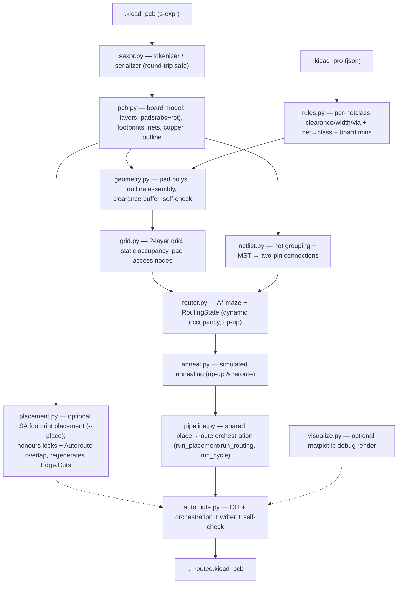

# PyAutoRoute — architecture & internals

Developer-facing notes on how the autorouter is put together: the data flow, each
module's job, the algorithms, and the non-obvious invariants that make the output
DRC-clean. For user-facing usage see the top-level `README.md`. For a friendly,
jargon-light explanation of *what each algorithm does* (and why), read
[`algorithms.md`](algorithms.md) first — this document is the precise reference
behind it.

## API documentation

Per-module HTML API docs (generated from the module docstrings) live in
[`docs/api/`](api/index.html) — open `docs/api/index.html` in a browser.
Regenerate them after changing docstrings with:

```bash
pip install -e ".[docs]"          # installs pdoc
pdoc pyautoroute -o docs/api
```

## Pipeline



Everything is plain Python plus numpy/scipy/shapely — there is **no `pcbnew`
dependency**. The only step that needs a full KiCad install is the *optional*
`kicad-cli pcb drc` cross-check; PyAutoRoute's own `geometry.clearance_violations`
provides an equivalent in-repo gate.

## Modules

### `sexpr.py` — round-trip-safe s-expressions
A tokenizer + recursive-descent parser producing nested `SList`/`Atom` trees, and
a serializer that reproduces KiCad's formatting.

- **Atoms keep their exact source text** (`Atom.raw`), so numbers and strings
  never get reformatted.
- **`SList` records its source span.** When serializing, an unmodified subtree is
  emitted **verbatim** from the original bytes. This sidesteps KiCad's per-object
  pretty-printing quirks (e.g. wrapping long `(pins ...)` lists, packing
  `(pts ...)` onto one line) and guarantees a **byte-identical round-trip** for
  anything we don't touch. Nodes we build ourselves have no span and use the
  generic formatter (atoms-only lists on one line; child-bearing lists as
  indented blocks; `pts` packed).

### `rules.py` — design rules from `.kicad_pro`
Parses `net_settings.classes` and `board.design_settings.rules` into a
`DesignRules` with per-net-class clearance / track width / via geometry, plus the
net→class resolver (explicit `netclass_assignments`, then glob `netclass_patterns`,
then `Default`). Effective values are floored by the board minimums. Falls back to
KiCad defaults when no project file is present. Handles both name-only nets
(KiCad 10) and numbered net tables (KiCad 6–9) downstream.

### `pcb.py` — board model + writer
Loads the board into a `Board`: copper layer stack, every `Pad` with **absolute**
position/rotation/shape/layers/net, the per-footprint grouping, free (dangling)
vias, existing segments and zones (with a `fill_enabled` flag for copper fills), and the Edge.Cuts outline shapes. Two file
conventions are handled transparently:

- **Net references** — `(net "GND")` (name-only) and `(net 3 "GND")` /
  `(net 3)` (numbered). The board's style is detected; the writer emits the same
  style.

A **`Footprint`** records each footprint's origin/rotation, its lock state (a bare
`locked` atom or `(locked yes)`), the `Autoroute-overlap` property flag, and each
pad's *local* offset/angle. This is what the optional placement pass moves:
`Footprint.sync_pads` recomputes the pads' absolute coordinates from a new pose,
and `Board.footprints` defaults to empty so callers that build a `Board` directly
are unaffected.

The **writer** (`write_board`) clones the parsed tree, drops the free vias, and
appends freshly-built `(segment …)` / `(via …)` nodes. Because untouched children
keep their source spans, the diff against the input is limited to the routing
edits. When placement has run, two helpers prepare the tree first:
`apply_placement` pushes the moved poses into the pads and replaces `Board.outline`
with a margin-grown bounding rectangle, and `sync_tree_from_placement` rewrites each
moved footprint's `(at …)` node (clearing its span so only that line changes) and
swaps the Edge.Cuts graphics for a single generated `gr_rect`. Under
`--keep-outline` both steps leave the existing Edge.Cuts untouched (the placement
was contained within it); `apply_placement` returns whether it kept the outline so
the writer stays consistent. For a footprint that was **rotated**, `_rotate_pad_nodes` adds the rotation delta
to each pad's `(at …)` angle — KiCad stores pad angles *absolutely*, so without
this a rotated footprint's pads would reload in their old orientation, mis-orienting
rectangular pads and failing DRC. The symmetric `_rotate_text_nodes` does the same
for `fp_text` and `property` `(at …)` angles so silkscreen labels also rotate with
the footprint in the written file.

**Interactive GUI constraint editing** — the module provides helpers for the GUI to
interactively set footprint constraints:
- `footprint_at(board, x, y)` — hit-test returning the smallest-area footprint
  whose bounding box contains (x, y).
- `set_footprint_edge(fp, side)` — set edge affinity (`"left"`, `"right"`, `"top"`,
  `"bottom"`, or `None`) and update the `Autoroute-edge` custom property.
- `set_footprint_overlap(fp, on)` — set overlap permission and update the
  `Autoroute-overlap` custom property.
- `set_footprint_locked(fp, locked)` — set lock state and update the `locked` flag.

These helpers properly span-invalidate the tree (clearing the span on mutated nodes)
so that only the changed properties are re-serialized, leaving the rest byte-identical.

### `geometry.py` — shapes & self-check
shapely geometry for pads (rect / roundrect / circle / oval / trapezoid; custom
falls back to bounding box), tracks, vias, and the board outline (stitching
`gr_line` / `gr_arc` / `gr_rect` / `gr_circle` / `gr_poly` via `polygonize`).
Loose edge segments are noded with `unary_union` before `polygonize`, so
outlines whose edges overlap or are collinear-redundant (rather than meeting at
a shared vertex — common in hand-edited KiCad boards) still close into a polygon.
`clearance_violations(board, rules)` is the **in-repo DRC self-check**: it
re-derives copper per layer and reports any different-net pair closer than the
required clearance, using an STRtree.

**Drill geometry.** `board_drills(board)` collects every drilled through-hole
pad (`thru_hole` / `np_thru_hole` with a `Pad.drill`) as a net-agnostic,
all-layer `Drill`. `drill_violations(board, rules)` is a second self-check: a
single STRtree pass that reports any hole pair whose edge-to-edge gap is below
the board's flat `min_hole_to_hole` rule. Unlike copper clearance there is **no
same-net exemption** — two holes on the same net still need spacing.
`board_obstacles` also emits an **all-layer barrel keep-out** for each drilled
pad on the copper layers it lacks a ring (the common case being a layerless NPTH
mounting hole), so the router never drives copper across a hole — see the
"DRC-clean by construction" invariant below.

### `grid.py` — static occupancy
A uniform node grid over the board's bounding box. `owner[layer, row, col]` holds
*static* occupancy:

- `FREE (-1)` — usable by any net;
- `BLOCKED (-2)` — board edge, no-net copper, or copper of two different nets;
- `net id` — copper of exactly one net (usable only by that net).

Built in three passes: edge mask (nodes outside the inset outline → BLOCKED),
obstacle owners (pads/segments/vias/zones inflated by the clearance margin), and a
**pad-interior override** (see invariants). Also provides coordinate conversion
and `pad_access_nodes` (grid nodes inside a pad polygon, the A* start/goal set).

### `router.py` — A* + dynamic occupancy
- **`RoutingState`** layers *dynamic* routed copper on top of the grid's static
  occupancy. It is keyed **per connection** (`cover[node] = {conn_idx}`,
  `conn_net[idx]`), so two connections of the same net never block each other and
  any single connection can be ripped up exactly — the foundation for annealing.
- **`astar`** searches states `(layer, col, row, incoming_dir)` over the cost
  model below, with octile heuristic to the nearest target.
- **`route_all`** routes a list of connections in a given order, committing each
  success.
- **`path_to_nodes`** converts a node path into KiCad segments (collinear runs
  merged) + vias (at layer changes), then **stubs each end to the pad anchor**
  (`_centre_stub`): the A* path terminates on whichever pad-access grid node the
  search preferred, so a short segment carries that endpoint to the pad centre
  (`Pad.cx/cy`, threaded through on `RouteResult.src_xy/dst_xy`). Both the node and
  the centre lie inside the pad, so the stub stays within the pad's own copper and
  introduces no clearance violation — but the track now ends exactly on the pad
  anchor, so KiCad keeps it attached when the footprint is moved. A stub shorter
  than `_STUB_EPS` (the centre already lands on a node) is dropped.
- **`CongestionField` / `congestion_frame` / `congestion_heatmap`** — the read-only
  signal behind `--place-feedback`. `congestion_heatmap` rasters one cycle's routed
  results onto a fixed coarse `CongestionField` (cell side a small multiple of the
  routing pitch): a unit per track node (more per via) marks where copper is dense,
  and a strong mark along the straight line between the endpoints of every
  *unrouted* connection marks where it couldn't run. The counts are Gaussian-blurred
  (so placement sees a gradient) and normalised to `[0, 1]`. `congestion_frame`
  fixes the field geometry once from the board's pad extent so successive cycles —
  whose per-cycle routing grids differ as footprints move — accumulate onto one
  raster; `CongestionField.blended` exponentially decays history into it. Routing
  itself is untouched: the field is only *read* off `RouteResult`s.

### `netlist.py` — rats-nest
Groups pads by net, drops `--exclude-net` matches, and reduces each multi-pad net
to two-pin connections via a **minimum spanning tree** over pad centroids
(`scipy.sparse.csgraph.minimum_spanning_tree`). `greedy_order` sorts connections
shortest-first for the initial routing pass.

`resolve_decoupling_ic(board, cap)` finds the IC a decoupling cap serves (for the
`Autoroute-decouple` placement term). A decoupling cap bridges a **power** net and
**ground**, both high-fanout, so net membership alone is ambiguous; the resolver
classifies the cap's two nets by name (`_net_kind`: ground / power / signal, with a
fallback that treats the non-ground net as the rail when its name is unrecognised),
then among footprints on the **power** net keeps the **IC-like** ones (refdes
`U…`/`IC…`, or ≥ 4 pads) and picks the **nearest** to the cap by pad centroid. It
returns `(ic_ref, candidates, warning)` — a warning is produced for a near-tie
between two ICs, no IC found, an unrecognised rail name, a non-unique refdes, or a
part that doesn't look like a decoupling cap (≠ 2 pad-nets, or it doesn't bridge
power and ground). Pure and deterministic; used by the GUI (at mark-time) and by
placement (to resolve an `auto` target).

### `anneal.py` — simulated annealing
Incremental rip-up & reroute over an already-committed routing. Moves: rip a
connection (failed *or* routed) plus its nearest neighbours and reroute the freed
cluster, swap the routing order of two, or reroute one. The cluster rip-and-reroute
is the move that shortens an already-complete board — freeing a local group and
re-routing it in a fresh order lets a connection take a more direct path than it
won in the sequential greedy pass (a plain single-connection reroute on unchanged
occupancy just returns the same path). Energy
`E = wirelength + via_weight·#vias + unrouted_weight·#unrouted`. Metropolis
acceptance under a geometric cooling schedule (`t_start` → `t_end`); the best-seen
routing is kept. Because the router is DRC-clean by construction, there is no
violation term. The energy/schedule knobs exposed on the CLI are `--via-weight`,
`--unrouted-weight`, and `--anneal-temps START END`; `rip_neighbours` and the
A* bend/via cost weights remain `AnnealParams`/`RouteParams` defaults.
Optional **stall detection** (`AnnealParams.stall_ratio`/`stall_patience`, off by
default) breaks the loop early when the windowed acceptance ratio stays below
`stall_ratio` for `stall_patience` consecutive accept-windows, still returning the
best routing.

### `placement.py` — optional footprint placement
The placement analogue of `anneal.py`, enabled by `--place`. Simulated annealing
over **footprint poses** (not tracks): moves are translate (a `--place-step`,
temperature-scaled random step), rotate (`--place-rotate`: `ortho` ±90°/180°,
`free` any angle, or `none`), or swap two footprints' origins (`--place-swap-prob`,
default 0.2), with Metropolis
acceptance under a geometric `--place-temps` (`t_start → t_end`) schedule and the
best-seen placement kept. A recent-window **acceptance ratio** is tracked (as in
`anneal`) and reported via the progress callback; `PlaceResult` also carries the
energy breakdown (`final_ratsnest`/`final_overlap`/`final_bbox`/`final_edge`) at
the best placement. Energy
`E = ratsnest + overlap_weight·overlap_area + compact_weight·bbox_area
+ edge_weight·edge_distance + containment_weight·area_outside_outline
+ congestion_weight·Σ field(centroid) + spread_weight·Σ count²
+ decouple_weight·Σ dist(cap, IC)`:

- **ratsnest** — total MST length over pad centroids, reusing `netlist`
  (`build_connections` + `Connection.est_length`). The connection topology is
  fixed for the run, so it is built once and only the lengths of connections
  incident on a moved footprint are recomputed per move (see incremental energy
  below).
- **overlap_area** — pairwise intersection of footprint body boxes via a shapely
  `STRtree` (as in `geometry.clearance_violations`). Each box is grown by half of
  `--place-buffer` per side, so a pair counts as overlapping until its gap exceeds
  the buffer; the optimiser then keeps footprints at least `buffer` apart, leaving
  room for routing clearance (the default is derived from the design-rule
  clearance). A pair where either footprint
  is `overlap_ok` (the `Autoroute-overlap` property) contributes only its
  *pad-vs-pad* overlap, not body overlap — the shield-over-board case. **Locked**
  footprints are immovable obstacles included in the overlap term.
- **bbox_area** — area of the bounding box of all footprints; compaction emerges
  from this term under cooling, with no separate phase.
- **edge_distance** — only for footprints that opt in via the `Autoroute-edge`
  property (`any`, or `left`/`right`/`top`/`bottom`; parsed into
  `Footprint.edge_affinity`). Each flagged footprint is penalised by the distance
  from its target side of the **current layout bounding box** to the **far** side
  of its box (`any` uses the nearest side). Measuring to the far side folds in the
  box's depth perpendicular to the edge, so the term both pulls connectors and the
  like onto the boundary **and** orients them to lie flat against it (long axis
  parallel) — otherwise a part could rotate so only one pad reached the edge.
  Measured against the layout bbox, so it stays translation-invariant like the
  rest; `_flagged` is empty when nothing opts in, so the term is identically zero
  by default. Under `--keep-outline` the reference is the **kept outline's**
  bounding box instead, so edge parts snap to the real board edge.
- **area_outside_outline** — only under `--keep-outline` with a closed Edge.Cuts:
  `containment_weight ×` (distance from each footprint box to the outline polygon
  `+` the box's protruding area). The distance gives a far-field gradient that
  pulls stray parts toward the board; the area term seats them fully inside. Both
  reach zero when the box is wholly within the outline. This **contains** the
  placement in the existing board shape rather than regenerating a bounding box;
  because it (and the keep-outline edge term) depend on absolute position,
  `place` skips `recenter` in this mode. Zero otherwise.
- **Σ count²** — only when `--place-spread-weight W` is set (default 0). The
  board is divided into a grid (sized by `spread_cells`, default 8 along the
  longer axis) and `Σ count²` across cells is penalised, which by
  Cauchy-Schwarz is minimised when all counts are equal — driving a uniform
  footprint distribution. Addresses the cluster-in-corner failure mode with
  `--keep-outline` and locked corner parts: the locked parts pin
  `bbox_area` to a constant, leaving `compact_weight` with zero gradient;
  `spread_weight` provides the spreading force instead. Incremental: each
  move decrements the old cell's count, increments the new one, and
  recomputes the sum-of-squares in O(1). Zero (and grid not allocated) when
  `spread_weight = 0`.
- **Σ field(centroid)** — only under **congestion feedback** (`--place-feedback`),
  when a `router.CongestionField` from a previous cycle's routing is supplied
  (`PlaceParams.congestion_field`/`congestion_weight`). Each footprint's body-box
  centre is sampled in the coarse field (high where routing struggled — dense
  copper, vias, and the regions of unrouted nets) and the values summed, so
  minimising the term spreads parts **out of** the hot cells. The field is in
  absolute board coordinates (it anchors the layout to/away from real cells), so
  like `--keep-outline` it makes the energy position-dependent and `place` skips
  `recenter`. Zero (and skipped) when no field is supplied. See **Congestion
  feedback** under `autoroute.py` for how the field is built and accumulated.
- **Σ dist(cap, IC)** — only when a footprint is marked a **decoupling cap** via
  the `Autoroute-decouple` property (`pcb.Footprint.decouple_target`: an IC refdes
  or `auto`). At setup `_build_decouple_pairs` resolves each mark to a
  `(cap-index, IC-index)` pair — a concrete refdes is looked up directly, `auto`
  via `netlist.resolve_decoupling_ic` — and the term sums the cap↔IC pad-centroid
  distance over the pairs, **softly** pulling each cap toward its IC. It is a
  *bias*, not a pin: the cap still rotates and shuffles, and the overlap/buffer
  term stops it landing *on* the IC, so it seats at the buffer gap (a flexible
  alternative to a rigid group). Translation-invariant (depends only on the
  separation). Incremental like the ratsnest: a `_fp_decouple` index recomputes
  only the pairs incident on a moved footprint. Unresolvable marks are skipped and
  surfaced in `PlaceResult.warnings`. Zero when nothing is marked or
  `decouple_weight = 0` (the pairs are not even built).

**Incremental energy.** The energy is cached and updated per move rather than
recomputed wholesale: `_rebuild_cache` does the one-time full pass (and runs again
only at the final report), while `_move_delta` updates just the parts a move can
change — the lengths of connections incident on the moved footprint(s), those
footprints' overlap contributions (against neighbours and fixed silk text), and
the layout bbox (and, when any footprint is flagged, the edge term, and under
feedback the congestion sum — each an O(N) pass over the cached per-box bounds
since they depend on the global layout extent / each centroid's field cell). A
rejected move restores the disturbed cache entries via `_save_cache` /
`_load_cache` (a snapshot of the scalar totals plus the moved boxes/bounds, the
incident connection lengths, the spread bookkeeping, and the incident decoupling-
pair distances). This turns each iteration from O(P² + N·log N) into roughly
O(deg + neighbours). Optional **stall
detection** (`PlaceParams.stall_ratio`/`stall_patience`, off by default) mirrors
`anneal`'s.

Each move keeps the moved footprint's pad coordinates in sync
(`Footprint.sync_pads`) so the energy geometry stays consistent.

**Post-anneal polish (`--place-polish`).** Annealing is a global *explorer*; it
rarely sits exactly at the bottom of its local energy basin, leaving close
contacts a fraction too tight and a few percent of slack in the smooth terms. When
enabled, `_Placer._polish` runs after the SA loop has restored its best placement
(and inside each best-of-N run, so the runs are compared *polished*): a
**steepest-descent** refinement that, for each movable unit (single footprint or
group), estimates the 2-D gradient of its translation by **central finite
differences** — reusing `_save_cache`/`_move_delta`/`_load_cache` to probe and
revert a trial shift cheaply — then takes a **backtracking line search** step
along the normalised descent direction (`_energy_after_translate` to probe,
`_commit_translate` to keep). Only strictly-improving steps are committed, so the
stage is **monotone**: `best_energy` (and the breakdown) can only fall, never
rise. It is **translations only** (rotation is left to annealing — discrete in
`ortho` mode and noisy for the overlap term), and operates on the same
`_move_units` as SA, so **locks and KiCad groups are respected** (locked parts are
absent from the units; a group translates as a rigid body). The descent sweeps
until a sweep barely helps (`polish_tol`), the sweep budget (`polish_iters`) or
optional time budget (`polish_time`) is spent, or `cancel` is set;
`PlaceResult.polish_sweeps`/`polish_improvement` report what it did. Finite
differences (rather than analytic gradients) keep the non-smooth Shapely overlap /
containment terms usable — and because the line search tests the *true* energy, a
noisy or zero gradient (e.g. from the piecewise-constant spread term) is harmless.
Off by default (`polish=False`), reproducing the prior behaviour exactly.

**Recentering (anti-drift).** Every energy term depends only on the footprints'
*relative* poses, so the energy is **translation-invariant**: with nothing locked,
the cluster random-walks during annealing and drifts off the board origin — the
more iterations run, the further it migrates (this became visible once the Cython
core let many more iterations run). Before returning, `place()` calls `recenter`,
which shifts every movable footprint by one rigid offset so their centroid returns
to where it started. Because it is a pure translation it leaves every energy term
(and the `PlaceResult`) exactly unchanged. It is a no-op when any footprint is
locked: locked footprints anchor the layout in absolute coordinates, so there is no
drift to undo and shifting the movable group would only break alignment with them.

`place()` leaves
the board at the best placement; `autoroute` then calls `pcb.apply_placement` (pads
+ new outline) before building the grid, and `pcb.sync_tree_from_placement` before
the write. The whole stage is transparent to the router, which already consumes
`Board.pads` and `Board.outline`. **Best-of-N runs and scatter.** `place(runs=N)` repeats the SA loop N times (seeds
`seed, seed+1, …`) and keeps the lowest-energy result. When `PlaceParams.scatter_start`
is set (`--scatter`), each run calls `scatter_footprints(board, seed + k)` before
placing — randomising every unlocked footprint's position and rotation so each run
explores a completely different basin of attraction rather than refining the same
as-designed starting layout. Without scatter, each run starts from the original poses
(deterministic SA variation only). This is the same randomisation `--cycles` uses
between cycles; with `--place-runs > 1` it now fires between placement runs too.

CLI knobs: `--place-iters`/`--place-time`
(budget), `--place-temps` (schedule), `--place-step`, `--place-rotate`,
`--place-margin`, `--place-buffer` (inter-footprint keep-out),
`--place-overlap-weight`, `--place-compact-weight`,
`--place-polish` (+ `--place-polish-iters`/`--place-polish-time`/`--place-polish-eps`,
post-anneal gradient descent), `--place-decouple-weight` (decoupling-cap
attraction), `--scatter` (randomise starting layout per run/cycle); `--seed` is shared.

**Silkscreen text in body boxes.** `_fp_silk_text_extents` pre-computes a list of
`(local_x, local_y, half_diag)` for each visible, non-hidden silkscreen text item
(`property "Reference"` / `"Value"` and `fp_text` on `F.SilkS` / `B.SilkS`)
in a footprint. `_fp_box` transforms these local positions to board coordinates
using the footprint's current pose and extends the AABB to cover them (using a
rotation-invariant circular half-diagonal estimate). This means the overlap penalty
also pushes *text labels* apart — footprints won't be placed so close that their
Reference or Value silkscreen text overlaps a neighbour.

**Board-level silkscreen text.** Top-level `gr_text` items (connector pin labels, a
title block, "Bus Indicator" — silkscreen annotations that aren't part of any
footprint) are not in `Board.footprints`, so the placer would otherwise drop a
footprint straight on top of them. `_board_silk_text_boxes` scans the board tree
once for each visible, non-hidden silk `gr_text`, estimating its extent the same way
as footprint text (centre + half-diagonal, honouring the `at` angle and `justify`
anchor). These become *static* keep-out boxes (an `STRtree`), and
`_fixed_text_overlap` adds each footprint's intersection with them into the same
`overlap_weight` term — so footprints are pushed clear of fixed silkscreen text.
`overlap_ok` footprints (meant to sit over the board) are exempt.

### `pipeline.py` — shared place→route orchestration
The single home for the place→route flow, bound to **no** `Reporter`/Tk objects:
live progress flows through optional, no-op-by-default hook callbacks, so the same
code runs on the CLI, in the GUI worker, and in `ProcessPoolExecutor` workers.

- **`run_placement`** (best-of-`place_runs`) and **`run_routing`** (best-of-`runs`,
  sequential or — when `jobs > 1` — across worker processes) are the two halves of
  the full pipeline, driven by `PipelineHooks` (phase/run boundaries, placement &
  anneal progress, route partials, snapshots, per-run + overall-best). Both
  `autoroute.run` (its non-cycle path) and the GUI worker call these, each
  supplying hooks that translate progress into their own front-end (the CLI's
  `Reporter` lines; the GUI's `Phase`/`Progress`/`BoardSnap` events) — this is the
  dedup that removed the duplicated orchestration. `run()` calls the two
  separately so it can slot `--auto` (grid/via probing on the placed board)
  between them; `run_pipeline` composes them for callers that don't.
- **`run_cycle`** loads a fresh board, places it once (seed `k`, honouring any
  congestion field in the `PlaceParams`), routes it, and returns a picklable
  `CycleResult` (`score = (unrouted, energy)`, carrying `conns` so feedback can find
  the unrouted endpoints); `select_best` keeps the lowest. This is the **cycle**
  unit `--cycles N` runs (inline or via the picklable `_cycle_worker`) to pick the
  placement that *routes* best — and the unit `--place-feedback` chains.
- The routing helpers **`_route_one_run`** / **`_route_run_worker`** live here too
  (routing is a cycle's/run's second half); `autoroute`'s `--runs` best-of-N and
  `run_routing`'s parallel path dispatch through them.

### `autoroute.py` — CLI & orchestration
**Settings file.** `--config FILE` is resolved by a throwaway pre-parser that reads
only `--config`; its `[pyautoroute]` values are coerced to each option's type
(`load_config`, keyed by argparse `dest`) and pushed in via `parser.set_defaults`,
so a value given on the command line still wins — precedence is defaults < config <
CLI, for free. `--write-config` dumps the effective namespace back to INI
(`write_config`) and exits. List/2-tuple options are comma-separated; flags are
`true`/`false`.

**Best-of-N.** `--runs N` repeats the route + anneal loop N times (seed stepped per
run, fresh `RoutingState` over the one deterministic `Grid`) and keeps the
lowest-energy routing (scored by `anneal._energy`); without annealing the greedy
route is deterministic so N collapses to 1. `--place-runs N` is the placement
analogue, implemented in `placement.place(runs=N)` (each run restarts from the
original poses, the best placement is kept). The shared per-run body lives in
`pipeline._route_one_run` (greedy route + optional anneal). With `--jobs`/`-j N`
(and `runs > 1`) the runs are dispatched across a `ProcessPoolExecutor`: the
picklable `pipeline._route_run_worker` re-invokes `_route_one_run` in each worker
(the `Grid` and connections pickle directly, so no re-parse), the main process
collects futures as they resolve and keeps the lowest-energy one — the same
selection rule as the sequential path. Per-run live progress is suppressed in
parallel mode. `--jobs 1` (default) keeps the byte-identical sequential loop with
full progress.

**Best-of-cycles.** `--runs`/`--place-runs` select by a *proxy* (routing energy on
one placement; placement energy on one routing). `--cycles N` (with `--place`)
instead runs N independent **place→route** cycles and keeps the one that *routes*
best. `_run_cycles` builds the placement/route params once, then for each cycle
calls `pipeline.run_cycle` — which re-loads the board (so no state leaks), places
it (one run, seed `seed + k`), finalises the placement into the tree, builds the
`Grid`, and routes via `_route_one_run` keyed off the same seed — returning a
picklable `CycleResult`. `select_best` keeps the lowest `CycleResult.score`, a
lexicographic `(unrouted, energy)` so completing connections dominates. `--jobs`
parallelises cycles across a `ProcessPoolExecutor` (the picklable `_cycle_worker`)
exactly as `--runs` parallelises routing; the winner is written/refilled/
self-checked through the shared tail. `--cycles 1` (default) takes the original
single-pass path untouched.

**Congestion feedback.** `--place-feedback` (with `--cycles N`) turns the
independent cycles into a *learning* loop (PathFinder-style): each cycle re-places
under a congestion field accumulated from the previous cycles' routing, so parts
spread out of the cells where routing struggled. `_run_cycles` fixes a board-wide
`router.congestion_frame` once, runs the cycles **sequentially** (feedback couples
each to the last, so it can't go across workers — it forces `--jobs 1`), and after
each cycle folds `router.congestion_heatmap(cr.conns, cr.results, cr.grid, frame)`
into the running field via `CongestionField.blended` (history weight `_FEEDBACK_DECAY`).
The next cycle places with `replace(pp, congestion_field=field, congestion_weight=…)`;
cycle 0 has no field. The **fresh re-placement** strategy (each cycle re-places from
scratch under the field, not perturbing the best-so-far) keeps every cycle an
independent attempt with the field as the only memory carried forward — and because
`select_best` still keeps the lowest **routed** score, feedback can only help or be
discarded. Opt-in and experimental (coupled place/route loops can oscillate; the
keep-best gate and decayed blend are the guardrails).

**Shared place→route.** `run()`'s own placement and routing(best-of-N, sequential
+ parallel) loops are not hand-rolled — it calls `pipeline.run_placement` then
(after any `--auto`) `pipeline.run_routing`, with a `Reporter`-backed
`PipelineHooks` mapping progress to its live display and log. The GUI worker calls
the *same* two functions with an event-posting hooks object, so the place→route
orchestration exists once for both front-ends (the duplication `plans/gui-plan.md`
flagged is gone). The GUI also exposes **best-of-cycles** and **congestion
feedback**: when its *Cycles* control is > 1 (place+route mode), the worker drives
`pipeline.run_cycle` in the same loop the CLI's `_run_cycles` uses — reusing the
shared cycle unit rather than re-implementing place+route — with a leaner
`CycleHooks` posting per-cycle `Phase`/`Progress`/`BoardSnap` events and the
*Congestion feedback* checkbox accumulating the field exactly as the CLI does.

Argument parsing, the parse → (place) → grid → route → (anneal) → write flow, the live
text progress `Reporter` (single-line `\r` updates on a TTY, line-by-line
otherwise, silent under `--quiet`), the metrics report, and the post-write
self-check. `default_output` names the file for the run — `_routed`,
`_placed_routed` (`--place`), or `_placed` (`--place-only`). `--place-only` runs
the placement pass then writes the placed board and returns *before* the
netlist/grid/route phases; `_finish` (timing + log close) and the
self-check are shared with the routing path. Exit code 2 if the self-check finds a
violation. The version
(`pyautoroute.__version__`, read from the installed package metadata) is printed
on startup and written to the `--log` header; `--version` prints it and exits.

`coarse_grid_note` prints (and logs) a heads-up when the effective `--grid`
pitch exceeds ~2× the rules-derived pitch (`default_pitch` = `track/2 +
clearance`): clearance is enforced discretely on the grid, so a coarse grid
can't fit a node in the gap beside a pad and forces a via under it where a finer
grid would route on a single layer.

Two diagnostic options hook into this flow:
- **`--snapshots N`** writes `N` intermediate routed boards to a `snapshots/`
  subdir during annealing. The annealer fires an `on_snapshot(k, n, results)`
  callback as it crosses each `k/N` of its progress (by iteration for `--routing-iters`,
  by wall-clock for `--routing-time`); the run() callback serialises the current routing
  to `snapshots/<input>_anneal_<k>of<N>.kicad_pcb`. The final snapshot captures
  the best routing. No-op (with a note) if neither `--routing-iters` nor `--routing-time` is set.
- **`--log [FILE]`** tees a verbose plain-text log: a parameter/board dump up
  front, a throttled trace of routing and annealing progress, snapshot events,
  and the final metrics — all timestamped. The `Reporter` owns the file and
  writes regardless of `--quiet`. Bare `--log` uses `<output>.log`.

### `visualize.py` — board rendering
`draw_board(ax, board, *, results=None, grid=None, rats_nest=None, title=None, fp_heat=None, conn_heat=None)`
paints the outline, pads, tracks, and vias onto a caller-supplied matplotlib Axes
(clearing it first, so it can refresh a live view). It backs the GUI canvas
(`gui.canvas.BoardCanvas` embeds a Figure and calls it directly); matplotlib is a
GUI-only dependency. Passing `results` (+ `grid`) draws an in-progress routing
straight from the router's node paths, before any segments are written to the
board; passing `rats_nest` (a list of `(x1, y1, x2, y2)` airwire segments) overlays
the unrouted connections as thin dashed lines beneath the copper — the GUI's
"Rats-nest" view toggle (`gui.app` computes the segments via `netlist.build_connections`,
filtering to the connections whose `results[i]` is `None`).

**Energy heat overlay.** `fp_heat` and `conn_heat` (produced by `placement.energy_heatmap`)
add a placement-energy heat layer on top of the board: `fp_heat` is a dict
`{ref: (x0, y0, x1, y1, normalised_cost)}` rendered as semi-transparent filled
rectangles; `conn_heat` is a list of `(x1, y1, x2, y2, normalised_len)` rendered as
coloured line segments. Both use the `RdYlBu_r` colormap (blue = low, red = high) and
are drawn at a low z-order beneath footprint outlines so they don't obscure copper.

`energy_heatmap(board, params=None)` in `placement.py` computes the per-footprint and
per-connection cost breakdown using the `_Placer` machinery (without running annealing):
it calls `_rebuild_cache()` to compute ratsnest lengths and footprint overlap areas,
normalises each to `[0, 1]`, and returns `(fp_heat, conn_heat)`. The function is
intentionally lightweight — it re-uses the incremental energy cache rather than
re-running any optimisation pass.

**Constraint markers** — in the GUI's Initial view, `draw_board` also renders
per-footprint constraint visualizations via `_draw_autoroute_markers()`:
- **Edge affinity** — coloured arrows (left, right, top, bottom) anchored to each
  constrained footprint's centroid.
- **Lock** — red square outline (`mfc="none"`) at each locked footprint.
- **Legend** — a small text legend in the upper right (only when markers are present)
  showing which constraint types are active. The legend uses `matplotlib.lines.Line2D`
  proxy artists for clean styling.

### `gui/` — interactive GUI (optional)
The interactive graphical front-end (launched as `pyautoroute BOARD.kicad_pcb`
when matplotlib is installed) allows real-time board inspection and footprint
constraint editing. Main components:

- **`app.py`** — main window orchestration, event routing, and constraint
  state management. Wires the click handler from the canvas to `_on_footprint_pick()`,
  which shows a context menu for editing edge affinity, lock, and overlap constraints.
  Handles dirty-state tracking and prompts on Run/Open when unsaved edits exist.
  `_save_constraints()` serialises changed constraints back to the `.kicad_pcb` file
  with a timestamped backup.
- **`canvas.py`** — matplotlib embedding, board rendering, and click forwarding.
  Exposes `_on_pick(board_x, board_y, mpl_event)` callback for footprint selection.
- **`controls.py`** — left panel (board input, pipeline options, placement/routing
  toggles, settings I/O). Hosts the "Save Constraints" button (disabled until
  constraint edits are made) and a **Save As…** button (disabled until a routed
  result is available) that opens a file-save dialog and copies the result board to
  the chosen path via `shutil.copy2`.
- **Energy heat map** — `app.py` exposes an *Energy heat* toggle checkbox in the
  view bar. When on, `_heat_data(board)` calls `placement.energy_heatmap` and passes
  the result through `_render → canvas.show_board → draw_board` as `fp_heat`/`conn_heat`,
  overlaying footprints and connections with a `RdYlBu_r` cost colour scale.
- **Run-summary dialog** — the worker accumulates non-fatal warnings (mounting
  holes, ground plane, placement) via `Worker._warn` and carries them on the
  `Done` event's `warnings` field. `events.collect_issues(done)` (tkinter-free, so
  unit-tested) folds those together with unrouted connections and DRC violations
  (clearance vs hole-to-hole told apart by tuple shape); `app._show_issues_summary`
  shows a single `messagebox` **only when the list is non-empty**, replacing the
  former clearance-only popup.

### `tune.py` — parameter sweep & scoring
Scores a routing with a single objective
(`unrouted_weight·unrouted + length + via_weight·vias + time_weight·runtime`,
lower better — the annealer's energy plus a runtime tiebreaker) and sweeps the
critical parameters to find the best setting. `evaluate` routes a board under one
`Config` + seed and measures it; `sweep`/`sweep_board` run the search-space
configs over several seeds and score each by the **median** (so a lucky seed
doesn't win), reusing one parsed board and one grid per pitch; `best_config` picks
the lowest. The `pyautoroute-tune` CLI prints a per-board markdown report. `--auto`
(in `autoroute.py`) reuses `sweep`/`best_config` as a quick probe on the board (a
small `--auto-probe-time` budget), then sets `--grid`/`--via-weight` — after asking
to confirm on a TTY (`--auto-yes` skips). See [`tuning.md`](tuning.md) for the
method and roadmap. `tune` imports `default_pitch` from `autoroute`, so `autoroute`
imports `tune` lazily (inside `--auto`) to avoid a cycle.

### `fixup.py` — board fixup CLI
`pyautoroute-fix` corrects footprint-level issues that don't affect routing but
matter for fabrication.  Currently one operation:

- **`--values`** — calls `pcb.fix_value_layers(board)`, which walks every
  `(property "Value" ...)` (KiCad 7+) and `(fp_text value ...)` (KiCad 6)
  node in the board tree.  For each node not already on a silkscreen layer
  the `(layer ...)` atom is replaced with the front or back silk name (`F.SilkS`
  / `B.SilkS`, discovered from the board's own layer table) that matches the
  footprint's side.  Span invalidation on the changed `layer`, `property`,
  and `footprint` nodes ensures `write_board` re-serializes only those subtrees.

`--dry-run` reports what would change without writing.  `-o OUT` writes to a
separate output path instead of overwriting the input.

### `report.py` — connectivity analysis and routing statistics

`routing_stats(board, rules=None, exclude=None)` analyses an arbitrary routed board
(PyAutoRoute output, hand-routed, or another tool's) and returns a `RoutingStats`
summary: routed/total connections, total track length, via count, and DRC violations
(if rules are provided). Uses union-find over segment endpoints (snapped to a 0.01 mm
grid) to determine which connections are satisfied end-to-end, handling vias implicitly
because both the F.Cu and B.Cu segments share net name and endpoint position.

The optional `exclude` parameter filters out nets (e.g. copper-pour nets) so they don't
count toward completion or length. This is used by the board comparison tool to ensure
fair metrics across boards.

New field `ideal_length` = Σ`Connection.est_length` (straight-line sum of connection
distances) enables directness scoring: `directness = length / ideal_length` (1.0 is
perfectly straight, higher = more detours).

### `compare.py` — routed board comparison tool

`pyautoroute-compare BOARD1 BOARD2 [BOARD3]` compares 2–3 routed boards of the same
design using unified metrics. Automatically detects copper-pour nets (union across all
boards) and excludes them, so each metric focuses on signal routing. Produces a
columnar report ranking boards by score (`unrouted_weight·unrouted + length + via_weight·vias`),
flags boards with DRC violations, and analyses the results with prose. Calls `routing_stats`
on each board with the same exclude set and design rules (auto-detected from the first
board's sibling `.kicad_pro`), then formats the results for comparison.

### `groundplane.py` — auto-add ground plane after routing

`--ground-plane` emits a GND copper-pour zone boundary following the board outline
(inset by margin) and adds connecting vias where GND is isolated to only one layer
(e.g. SMD-only pads on F.Cu). Uses `geometry.outline_to_polygon().buffer(-margin)`
for the boundary, then calls `pcb.make_zone_node()` (in pcb.py) to emit the zone
s-expression with `(fill yes …)` so `kicad-cli` picks it up on refill. Connectivity
vias are found by union-find over GND copper (pads + segments + vias), tracking which
layers each component reaches. Optional `--stitch-vias [PITCH]` lays a regular grid
of GND vias to tie planes together.

**Critical invariant:** `geometry.board_obstacles` (and thus `clearance_violations`)
skips filled zones, so PyAutoRoute's self-check cannot verify the pour's clearance —
that is delegated to KiCad's fill / `kicad-cli`. The self-check passes for the routed
traces; the zone boundary is emitted but unfilled if `kicad-cli` is absent (warned).

### `mountingholes.py` — auto-add NPTH mounting holes

`--mounting-holes` resolves hole positions from **location codes** (`TL`/`TR`/`BL`/
`BR` corners, `T`/`B`/`L`/`R` edge mid-points, `C` centre — Y-down, so "top" = min y)
and/or explicit `x,y`, inset from the outline's bounding box by `--hole-margin`.
`build()` validates each against the outline, existing copper (`board_obstacles`),
and other holes (`board_drills` + `min_hole_to_hole`), skipping any that collide
with a warning. It also handles boards that **already have holes**: a requested
position coinciding with an existing drill is reported as already-present (so
re-runs are idempotent), and `_ref_allocator` picks `MH<n>` refs that don't
collide with refs already on the board. Accepted holes are emitted by
`pcb.make_npth()` (a `MountingHole` footprint with a netless `np_thru_hole` pad,
`size == drill`) and appended to `board.tree` (so they are written) and
`board.pads` (so they are seen as obstacles on reload and during routing).

**Placement keep-out.** When `build(..., lock=True)` the hole is *also* registered
as a **locked footprint** in `board.footprints`, which the placement annealer
treats as a fixed obstacle (it only repels footprints from other footprints, not
loose pads — `placement.py`). `mountingholes.positions_known_preplacement()`
decides timing: explicit `x,y` holes (always) and code holes under `--keep-outline`
are injected *before* placement (locked, felt and animated); corner/edge holes on
an auto-generated outline can't be known until placement finishes, so they fall
back to a post-placement injection (with a printed note). `autoroute.run` and
`gui/worker.py` apply this split symmetrically. With `--cycles` (each cycle routes
a board reloaded from disk) holes are always injected into the winning board after
routing, and a track crossing a hole is reported by the self-/drill-check rather
than avoided.

### `pyautoroute.sh` — helper menu
A repo-root Bash script offering a menu of common tasks (install, regenerate API
docs via the `pdoc` recipe, run the short/long test suite, run the performance
benchmarks in `tests/perf/` standalone, route a test board, write a settings file,
clean generated outputs). Each action echoes the command it runs; the interpreter
is overridable with `PYTHON=`.

## Coordinate system & the pad-angle gotcha

All geometry is in **KiCad board coordinates**: millimetres, **Y pointing down**.

- **Pad position** uses KiCad's `RotatePoint` convention to rotate the pad's local
  offset by the footprint orientation, then translate:
  `x' = px·cos(fa) + py·sin(fa)`, `y' = −px·sin(fa) + py·cos(fa)`
  (see `pcb.rotate`). shapely rotations use `affinity.rotate(geom, −angle)` to
  match.
- **Pad orientation** — KiCad stores the pad's `(at x y angle)` angle
  **absolutely**: it already includes the footprint rotation. So `pad.angle` is the
  stored value, **not** `footprint_angle + pad_angle`. Getting this wrong silently
  transposes the width/height of rotated rectangular pads and produces phantom
  "unconnected" reports (the track lands just outside the real pad). Verified
  against `kicad-cli` connectivity on a `-90°` footprint with `270°` pads.

## Occupancy & the "DRC-clean by construction" invariant

Clearance is enforced discretely on the grid, not checked after the fact.

- **Obstacle inflation.** Each obstacle is grown by
  `margin = hypot(max_track/2 + max_clearance, safety)` before marking grid
  owners, where `safety = pitch · √2 / 2`. The `max_track/2` term is the *routing*
  track's half-width (a forbidden node is for a track centre, so the centre must
  clear by the routing track's half-width plus clearance), and `max_*` are taken
  across net classes so the single global margin is safe on multi-class boards.
  The safety term covers grid discretisation: a point on a track segment between
  two free node-centres can sit up to half a diagonal (`safety`) from the nearer
  node. The required keep-out `clear = max_track/2 + max_clearance` and that offset
  are **perpendicular in the worst case** (obstacle abeam the segment midpoint),
  so they combine *in quadrature* — `hypot(clear, safety)`, not `clear + safety`.
  A node kept that far from an obstacle guarantees the whole segment stays `clear`
  away; summing the two terms linearly instead is safe but over-inflates by up to
  `safety`, which can wall off dense through-hole clusters that are in fact
  routable.
- **Committed copper is inflated the same way.** A routed track/via is treated
  like a pad obstacle: its copper is grown by the full `margin` (i.e. with the
  `max_track/2` term inside the quadrature, not `hypot(max_clearance, safety)`)
  when marked owned. The routing-track half-width term is
  essential here — on a multi-class board a later wide (e.g. 0.6 mm) track would
  otherwise encroach on an earlier track's clearance. (On uniform single-class
  boards the safety slack masked this; a wide-track multi-class board exposed it.)
- **Vias clear more area than tracks.** A via uses
  `via_margin = hypot(via_diameter/2 + clearance, safety)` (same quadrature
  combination; the board edge keep-out `edge_margin` is built the same way).
  `can_via` checks the whole
  via-clearance disk is free on **both** layers (a stencil of node offsets), and
  committing a via marks that disk on every layer. Omitting this was the original
  source of shorts/hole-clearance violations.
- **Pad-interior override.** Nodes strictly inside a *real* pad polygon are forced
  to that pad's net, overriding any foreign clearance zone. A track may always
  enter its own pad (the pad copper is already there, so it adds no new clearance
  violation), while the inflated zone *outside* the pad still keeps other nets
  clear of it. Without this, tightly-packed pads (e.g. a DIP switch flanked by
  other nets) have their interiors flooded by neighbours' clearance and the router
  stops one cell short, producing unconnected tracks.

- **Drill barrels are keep-outs too.** A drilled through-hole pad contributes an
  all-layer barrel disk to `board_obstacles` on any copper layer it lacks a ring
  (e.g. a non-plated mounting hole with no copper). The barrel is inflated by the
  same `margin`, so copper can never be routed across a hole — for the same
  reason it can't cross a pad: the keep-out is baked into the grid before A\*
  runs. Hole-*to-hole* spacing (`min_hole_to_hole`) is not a routing constraint
  but a placement/DRC one, reported by `geometry.drill_violations`.

Net result: a route returned by A* over this occupancy is clearance-legal as a
continuous shape, so the written board passes DRC. Connections that can't be
routed are dropped and reported, never drawn with violations.

## A\* cost model

Per step (all in mm so length dominates):

- straight = `pitch`; diagonal = `pitch·√2` (true length, so a 45° run beats a 90° staircase);
- **bend penalty** on direction change, increasing with the turn angle (`bend45 < bend90 < bend135 < bend180`) so diagonal routing is preferred;
- **via cost** (`via_cost`, mm-equivalent) on a layer change;
- **back-layer penalty** per step on a non-front layer so F.Cu wins ties;
- heuristic = octile distance to the nearest target × pitch (admissible — every extra term is non-negative).

State includes the incoming direction so bend penalties can be applied; diagonal
moves are forbidden from cutting a blocked corner.

**Bounded search (`RouteParams.search_margin`, the `--search-margin` flag).** By
default A\* searches the whole grid. When a margin (mm) is given, the per-net
`free` mask is additionally masked to a box around the source/target nodes grown
by that margin, so the frontier cannot leave the box. If the bounded search
fails, the box widens and the search retries, ultimately falling back to the full
grid — so a route is still found whenever one exists. The trade-off is a small
loss of optimality (a bounded route may be slightly longer than the global
minimum). Because the bound is applied purely through the `free` mask, both the
pure-Python loop and the Cython core honour it without any signature change. The
biggest win is the annealing rip-up/reroute loop, where each reroute is local but
an unbounded search would re-scan the whole board every iteration.

## Simulated annealing details

- **State** = the set of committed connection routes (in `RoutingState`).
- **Move** = rip up a small set of connections and reroute them, optionally in a
  new relative order. On rejection the move is reverted by ripping the new routes
  and re-committing the snapshots (committing is idempotent given a path).
- **Acceptance** = Metropolis: accept if `ΔE ≤ 0`, else with probability
  `exp(−ΔE/T)`. `T` follows a geometric schedule from `t_start` to `t_end`.
- **Budget** = `--routing-iters` or `--routing-time` (else a small default); the best-seen routing
  is returned regardless of where the walk ends.
- Per-route A* is expansion-capped during annealing so a hard net fails fast
  instead of exploring forever.
- **Cancellation** = an optional `threading.Event` passed to `anneal`/`placement`;
  when set, the loop stops early and returns the best-so-far. This backs a GUI Stop
  button (the SA runs on a worker thread; see `plans/gui-plan.md`).

## Testing

`pytest` (unit, integration, and end-to-end tests). Highlights:

- `test_sexpr` — byte-identical round-trip + structural faithfulness of the generic formatter.
- `test_pcb` — pad absolute position/rotation, both net formats, writer no-op byte-identity, free-via stripping, segment append.
- `test_rules`, `test_geometry`, `test_grid`, `test_netlist`, `test_router` — per-module behaviour (occupancy semantics, via crossing, diagonal preference, exact rip-up).
- `test_anneal` — best energy never worsens; routing stays clean after annealing.
- `test_placement` — placement energy never worsens; locked footprints stay put; bodies separate while `Autoroute-overlap` parts may overlap (pads kept apart); lock/property parsing, edge-affinity parallel-alignment, and the footprint-`(at)` + Edge.Cuts tree rewrite round-trip; silkscreen text extents returned by `_fp_silk_text_extents` and included in `_fp_box`.
- `test_congestion` — the congestion-feedback path: `CongestionField` sampling/blend, `congestion_frame`/`congestion_heatmap` (unrouted region marked, normalised), the placement congestion term spreading footprints out of hot cells (and deterministic / a no-op when off), and the `--place-feedback` CLI loop.
- `test_endtoend` — routes a synthetic board with a **`gr_line` outline** (generality) and `--exclude-net`, asserting zero clearance violations via the self-check.
- `test_boards` — parametrized over every board in `TestProjects/` (ids `Test1`..`Test5`; hidden stray files like `.kicad_pcb.kicad_pcb` are skipped): parse, round-trip, writer no-op, outline/pads-inside, and a routing self-check. Routing the large boards (>30 pads) is skipped by default and enabled with `pytest --slow` (defined in `conftest.py`).

The repo also carries `TestProjects/Test1/` (a real KiCad 10 board) used by the
integration tests and validated end-to-end with `kicad-cli pcb drc`.

## Known limitations / future work

- **Two layers only.** The stack is read generically but routing assumes F.Cu/B.Cu.
- **Copper fills.** Zones with `(fill yes …)` are auto-detected: their net is excluded from routing and placement, and the zone polygon is skipped in `board_obstacles` (it is not a routing obstacle). After writing the output board, `pcb.try_refill_zones` invokes `kicad-cli pcb drc --refill-zones --save-board` to regenerate the pour; if `kicad-cli` is not available the user is prompted to refill manually in KiCad. Zones without `fill yes` (e.g. keepouts, teardrops) are still treated as obstacles.
- **Custom pads** are approximated by their bounding box.
- **Conservative clearance for mixed net-class boards.** The single global inflation margin uses the maximum track/clearance across classes; exact per-net masks would route denser mixed-rule boards.
- **Hole-to-hole** is approximated by copper clearance rather than checked explicitly.
- **Performance.** A\* searches the whole grid by default, so a few long nets dominate runtime. The optional `--search-margin` bounds each search to a slack box around the connection (see *A\* cost model* above); enabling it by default once tuned remains future work.
