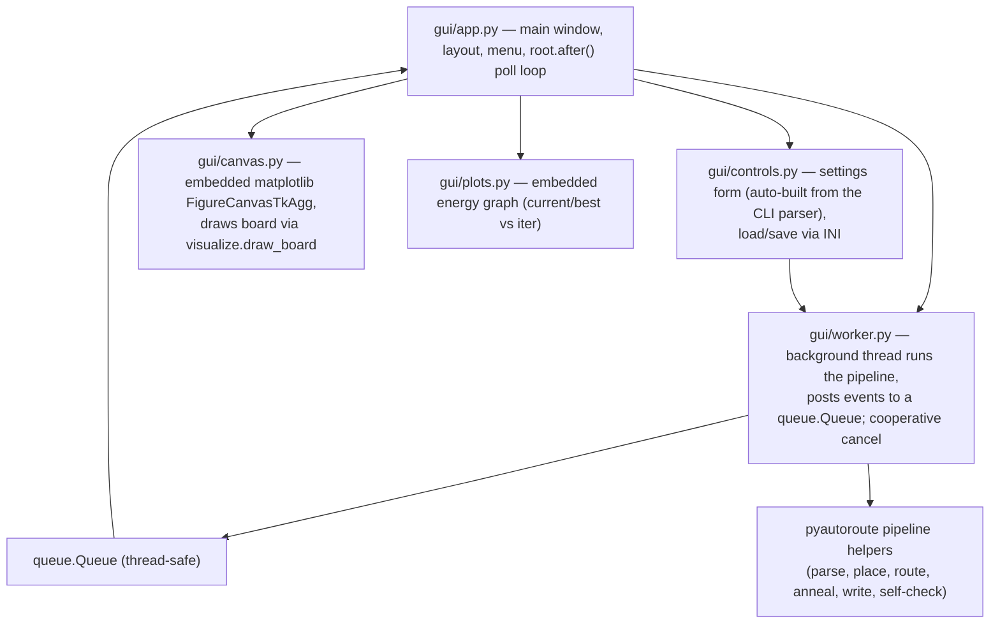

# Plan: a Tk GUI for PyAutoRoute

## Context

PyAutoRoute is a CLI today. This plan adds a **Tkinter desktop GUI** that opens a
KiCad project, runs the place/route pipeline with the useful settings exposed as
controls, **renders the board live as it optimises**, shows convergence telemetry
(energy graph, acceptance ratio, current/best energy, current/max iteration), and
lets the user **replace the original `.kicad_pcb`** with the result when happy.

It is additive: the CLI, library, and file formats are unchanged. The GUI is a thin
front-end over the existing modules (`pcb`, `placement`, `anneal`, `router`,
`grid`, `rules`, `netlist`, `tune`, `visualize`). This is the planning artifact
(the analogue of `docs/place-feature-plan.md` / `docs/improvements-plan.md`); a
follow-up PR implements it.

## Goals

- Open a KiCad project (`.kicad_pcb`, sibling `.kicad_pro` auto-detected) and show a
  board summary (layers, pads, nets, connections, rules).
- Controls for the useful **place / route** settings (grid, weights, schedules,
  budgets, runs, exclude-nets, placement knobs).
- A **board rendering**, updated **during** placement and routing progress.
- Telemetry: a live **energy graph** (current + best) plus readouts for
  **acceptance ratio**, **current/best energy**, **current/max iteration**,
  temperature, routed/unrouted, and elapsed time.
- **Run / Stop** (cooperative cancel, keeping the best-so-far).
- **Apply to project**: replace the original `.kicad_pcb` with the placed/routed
  board (with a backup), on explicit confirmation.
- Save/Load settings (reusing the PR6 INI `--config` format) and an optional
  **Suggest** button (reusing `tune`/`--auto`).

## Non-goals (v1)

- No interactive board editing (drag pads, hand-route) — it drives the optimiser,
  it is not a PCB editor.
- No 3D view, no Gerber/plot, no DRC UI beyond the existing self-check result.
- Not a replacement for KiCad; the user reviews the result in KiCad.

## Window layout

A single resizable window, paned:

```
┌───────────────┬──────────────────────────────┬───────────────────┐
│  Controls      │      Board canvas             │  Metrics          │
│  (scrollable)  │  (matplotlib, live render)    │  phase / elapsed  │
│  - file/open   │                               │  iter  cur/max    │
│  - mode        │                               │  energy cur/best  │
│  - grid        │                               │  accept %  temp   │
│  - routing …   │                               │  routed/unrouted  │
│  - placement … │                               │  self-check       │
│  Run  Stop     │                               │ ┌───────────────┐ │
│  Apply  Suggest│                               │ │ energy graph  │ │
│  Save  Load    │                               │ └───────────────┘ │
├───────────────┴──────────────────────────────┴───────────────────┤
│  log / status line                                                 │
└────────────────────────────────────────────────────────────────────┘
```

## Architecture

A small `pyautoroute/gui/` subpackage (Tk apps grow; keep concerns split):



### Threading model (the crux)

Tk is single-threaded and not thread-safe; the SA runs are long. So:

- **Main thread** owns the Tk event loop and **all** widget/canvas updates.
- A **worker thread** runs the pipeline. Its only interaction with the UI is to
  push immutable event objects onto a `queue.Queue`.
- The main thread drains the queue on a timer: `root.after(50, self._drain)`.
- **Cancellation** is a `threading.Event`; the worker passes it to `place`/`anneal`,
  which check it each iteration and break early, returning the best-so-far.

Event types posted by the worker:

| event | payload | UI effect |
|---|---|---|
| `Phase(name)` | phase string | status line + log |
| `Progress(kind, it, total, energy, best, temp, accept, routed, unrouted)` | per-iteration | update metric labels; append to energy series |
| `Board(payload)` | a **consistent snapshot** of draw geometry | redraw the board canvas |
| `Done(out_path, metrics, violations, board)` | final | enable Apply/Export; show summary |
| `Error(exc)` | exception | error dialog; re-enable Run |

`Progress`/`Board` are produced **inside the worker's `on_progress`/`on_snapshot`
callbacks**, which run synchronously on the worker thread while the board is in a
consistent state — so the snapshot copied into the event is race-free. The main
thread only ever reads from the queue.

### Live rendering

- Refactor `visualize.render()` to extract **`draw_board(ax, board, results=None,
  grid=None, title=None)`** (the drawing currently inlined in `render`). `render()`
  becomes a thin Agg wrapper around it. The GUI embeds a `Figure` via
  `matplotlib.backends.backend_tkagg.FigureCanvasTkAgg` and calls `draw_board` on
  the same axes, then `canvas.draw_idle()`.
- **Placement** mutates poses in place; the worker's throttled `on_progress`
  (≈ every 0.3 s wall-clock) copies the current pad geometry into a `Board` event.
- **Routing** uses the annealer's existing `on_snapshot(k, n, results)` hook with a
  reasonable count (e.g. `snapshots≈40`); the worker turns `results` into drawable
  geometry (`router.path_to_nodes` / segment coords) for a `Board` event. Finer,
  time-based live routing updates are a noted enhancement (a time-throttled board
  hook in `anneal`), not required for v1.
- Throttling + (for big boards) downsampling keeps redraws off the critical path.

### Energy graph + metrics

- `gui/plots.py` holds a second embedded `Figure`: two lines (current energy, best
  energy) vs iteration, fed from `Progress` events. Redraw is throttled (≈ 5 Hz) and
  the series is capped/downsampled for long runs so Tk stays responsive.
- Metric labels (acceptance %, current/best energy, iter `cur/max`, temperature,
  routed/unrouted, elapsed, self-check) are updated from the same events. These map
  directly to the callback signatures already emitted:
  - placement `on_progress(it, total, energy, best, temp, accept)`
  - anneal `on_progress(it, total, routed, unrouted, energy, best, temp, accept)`
  - greedy routing `on_progress(done, total, routed, unrouted)`

### Controls ↔ parameters

Rather than hand-maintaining a form that drifts from the CLI, **auto-build the
controls from the argparse parser**: reuse `autoroute._configurable_actions(parser)`
(added in PR6) to enumerate options, their types, choices, and help text, and
generate the right widget per action (Entry for float/int, Checkbutton for flags,
OptionMenu for `choices`, Entry for `--exclude-net`). Group them (File / Mode /
Routing / Placement). This keeps the GUI in lock-step with the CLI for free, and
**Save/Load settings reuse `autoroute.write_config`/`load_config`** so GUI presets
are the same `.pyautoroute.cfg` INI files the CLI consumes.

The **Mode** selector (Route only / Place + Route / Place only) maps to the same
flags as the CLI and drives which control groups are enabled and the output name
(`_routed` / `_placed_routed` / `_placed`).

### Replace-original workflow

- A run writes its result to the standard output path (`<input>_placed_routed`,
  etc.) and keeps the in-memory `Board`; the canvas shows it and the self-check
  result is displayed.
- **Apply to project** (enabled only after a clean run): a confirmation dialog, then
  back up the original to `<input>.kicad_pcb.bak` (timestamped if one exists) and
  `pcb.write_board` the result over the original `.kicad_pcb`. Only the `.kicad_pcb`
  is touched; `.kicad_pro`/`.kicad_sch` are left alone. The backup path is shown so
  the user can revert. Never overwrites without explicit confirmation.

## Required library changes (additive, minimal)

1. **`visualize.draw_board(ax, board, …)`** extracted from `render()` (render keeps
   working; GUI and PNG export share one drawing routine).
2. **Cooperative cancel**: optional `cancel: threading.Event | None` on
   `anneal.anneal` / `placement.place` (threaded to the loop's break check),
   returning the best-so-far. Non-breaking (defaults to `None`).
3. **Headless pipeline helpers**: factor the core place/route/anneal orchestration
   out of `autoroute.run()` into reusable functions (e.g. `pipeline.place_board`,
   `pipeline.route_board`) that take callbacks + a cancel event, so the GUI worker
   and the CLI share the exact same logic instead of duplicating it. Can be done
   incrementally; the CLI `run()` becomes a thin caller.

No file-format, occupancy, or algorithm changes.

## Dependencies & packaging

- **tkinter** is stdlib but ships separately on some Linux distros (`python3-tk`);
  document this and fail with a friendly message if missing.
- **matplotlib** already exists as the `[viz]` extra; add a **`[gui]`** extra
  (= `matplotlib`) and a console script **`pyautoroute-gui = "pyautoroute.gui.app:main"`**.
- Embed via the `TkAgg` Figure/`FigureCanvasTkAgg` API (no `pyplot` global state).
- Add a **"Launch GUI"** item to `pyautoroute.sh`.

## Testing strategy

GUI code is hard to test headlessly, so split testable logic from widgets:

- **Unit-testable, no display**: the worker/queue event protocol (drive it with a
  scripted fast "run" and assert the emitted events), the settings↔params mapping
  (parser action → widget value → namespace), `draw_board` (render onto an Agg
  axes and assert it drew the expected artist counts), the energy-series
  downsampling, and the backup/replace logic (temp dir: backup created, original
  overwritten, `.kicad_pro` untouched).
- **Widget smoke test**: construct the app against a real `Tk()` and `update()`
  (no `mainloop`), **skipped unless tkinter + a display are available** (so CI and
  this sandbox skip it cleanly).
- **Manual checklist** (in the PR): open a project; run each mode; watch the live
  render + energy graph + acceptance ratio; Stop mid-run and confirm best-so-far is
  kept; Apply-to-project and verify the backup + that KiCad opens the result.

(Note: this dev container has no tkinter, so the GUI can't be exercised here; the
non-UI logic tests still run.)

## Docs & version

- README: a "GUI" section (install incl. `python3-tk`, launch, screenshot,
  controls, Apply-to-project safety note).
- `docs/architecture.md`: a `gui/` module section + the threading/queue and
  live-render notes; mention `visualize.draw_board` and the pipeline helpers.
- Regenerate API docs (`pdoc -d google --mermaid`).
- Version bump **0.14.0 → 0.15.0** (new feature) when implemented.

## Phased implementation (suggested PRs)

1. **Refactor groundwork** — `visualize.draw_board`, `anneal`/`placement` cancel
   hooks, headless `pipeline` helpers extracted from `run()`. Tests stay green; no
   GUI yet.
2. **GUI skeleton** — window + paned layout, Open project, board summary, static
   embedded board render.
3. **Controls + presets** — parser-driven settings form; Save/Load via INI; Mode.
4. **Run/Stop + telemetry** — worker thread + queue; progress labels, progress bar,
   metric readouts; cancel.
5. **Live render + energy graph** — throttled board snapshots during place/route;
   embedded energy plot.
6. **Apply-to-project + extras** — backup + overwrite workflow, Export PNG, Suggest
   (tune/`--auto`).
7. **Docs + packaging + menu + version**.

## Open decisions (please confirm)

1. **Rendering tech** — embed **matplotlib** (reuse `visualize`, least code,
   consistent with `--debug-plot`) vs a native Tk `Canvas` renderer (faster live
   updates on large boards, more code). Recommend matplotlib for v1, revisit if live
   redraw is sluggish on big boards.
2. **Live routing granularity** — reuse the annealer's `on_snapshot` (≈40 frames per
   run, no lib change) vs add a time-throttled board hook to `anneal`. Recommend the
   snapshot approach for v1.
3. **Auto-built controls** — generate the form from the argparse parser (keeps
   CLI/GUI in sync automatically) vs a hand-built form (more layout control).
   Recommend auto-built, with manual grouping/labels.
4. **Scope of the refactor in step 1** — how much of `autoroute.run()` to extract
   into shared `pipeline` helpers now vs incrementally.
</content>
