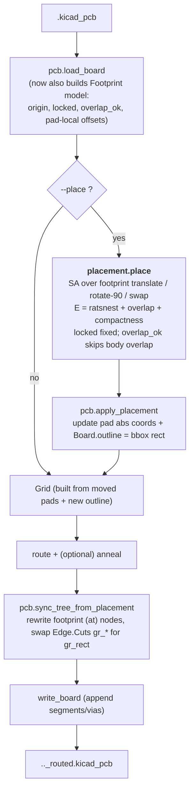

# Plan: experimental footprint auto-placement (`--place`)

> **Status: ✅ Implemented (shipped in 0.6.0).** All planned pieces exist — the
> `Footprint` model, `placement.py` (`_Placer`), `apply_placement` /
> `sync_tree_from_placement`, and the `--place*` flags. Later work made the energy
> incremental (0.22.0), added silkscreen-text awareness (0.19.0/0.21.0), and
> recentred the result (0.23.1). Living reference:
> [`docs/architecture.md`](docs/architecture.md). See the **TODO** at the bottom.

## Context

PyAutoRoute today takes a board with **already-placed** footprints and routes it.
This feature adds an *experimental, opt-in* pass that also **places** the
footprints first: arrange them to minimise rats-nest length and overlap, compact
the layout, generate a fitting board outline, then route. It mirrors what the
routing annealer (`anneal.py`) already does for tracks, but operates on footprint
positions/rotations instead.

Confirmed decisions:
- **Unified simulated-annealing** placement pass (not a multi-phase pipeline).
- Honour **KiCad-native footprint lock** for fixed positions; mark overlap-allowed
  footprints via a **footprint property field** (`Autoroute` = `overlap`).
- At the end, **replace Edge.Cuts** with a computed bounding rectangle enclosing
  the placed footprints (plus a margin); routing then uses that new outline.
- It is an **option**, not the default, and on completion the board is **routed**
  normally (place -> route in one run).

## Pipeline (new step in bold)

The grid/router/anneal stages are **unchanged** -- they already consume
`Board.pads` (absolute coords) and `Board.outline`, so updating those in place
makes placement transparent to the rest of the pipeline.

## Energy model (placement)

`E = ratsnest_length + overlap_weight*overlap_area + compact_weight*bbox_area`

- **ratsnest_length** -- sum over nets of the MST length over pad centroids. Reuse
  `netlist._mst_connections` + `Connection.est_length` (sum the edges). Recomputed
  per evaluation (fine for coarse placement; an incremental option is future work).
- **overlap_area** -- pairwise intersection area of footprint extents (bbox of each
  footprint's pad polygons), found via a shapely `STRtree` like
  `geometry.clearance_violations`. Pairs where either footprint is `overlap_ok`
  contribute only **pad-vs-pad** overlap, not body overlap (the Arduino-shield
  case). Locked footprints are immovable obstacles included in the overlap term.
- **bbox_area** -- area of the bounding box of all footprint extents; pulls the
  layout together (the compaction emerges from this term + cooling, no separate
  phase).

Moves (movable = not locked): translate by a random step, rotate by +/-90 deg, or
swap two footprints' origins. Metropolis acceptance under a geometric
`t_start -> t_end` schedule; best-seen placement kept -- same structure as
`anneal._Annealer`.

Initial seed: optionally re-grid movable footprints on a lattice spaced by the
largest footprint extent to start from a de-overlapped state; locked footprints
stay put.

## Files & changes

### `pyautoroute/pcb.py`
- New `Footprint` dataclass: `ref, x, y, angle, locked, overlap_ok, pads,
  local_offsets (list of (px,py,pad_angle)), at_node, fp_node`.
- Add `Board.footprints: list[Footprint] = field(default_factory=list)` -- **must
  default** so existing constructors keep working.
- In `load_board`, build the `Footprint` list: capture origin `(fx,fy,fa)`, detect
  lock (bare `locked` atom **or** `(locked yes)` child of the footprint node), read
  the `Autoroute`/`overlap` property via the existing `children(fp,"property")`
  pattern, and stash each pad's local `(px,py,pad_angle)`.
- `apply_placement(board, margin)` -- recompute every moved pad's absolute
  `cx/cy/angle` from its footprint's new origin, and set `board.outline` to a single
  `OutlineShape` `rect` = bbox of all pads + `margin`.
- `sync_tree_from_placement(board)` -- for each moved footprint: clear
  `fp_node.span` and replace its `(at ...)` child with a fresh `(at x y angle)`;
  remove the old Edge.Cuts `gr_*` nodes from `board.tree` and append a fresh
  `(gr_rect ...)` on `Edge.Cuts`. Clearing the span is required so the footprint
  re-serialises generically -- children keep their spans and emit verbatim, so the
  only real diff is the footprint `(at)` line.

### `pyautoroute/placement.py` (new)
Mirrors `anneal.py`: `PlaceParams`, `PlaceResult`, a `_Placer` with `_energy`,
`_propose`, `_apply`, `_revert`, `run`, and a public `place(board, params,
on_progress=None)`. Operates on the `Footprint`/`Pad` model, updating pad abs
coords on each move so the energy geometry stays consistent. Returns best placement
+ stats; leaves `board` at the best state.

### `pyautoroute/autoroute.py`
- New flags: `--place` (enable), `--place-iters N` / `--place-time S` (budget),
  `--place-margin MM`, `--place-overlap-weight`, `--place-compact-weight`. Reuse
  `--seed`.
- In `run()`: after parse, if `--place`, emit a `placement` phase, call
  `placement.place(...)` then `pcb.apply_placement(...)`, log start/best energy and
  moved count. Build the grid from the updated board. Before the final write, call
  `pcb.sync_tree_from_placement(board)`.

### Tests -- `tests/test_placement.py` (new)
Synthetic `Board` with a few `Footprint`s. Assert: best energy never worsens;
locked footprints don't move; no body-overlap among non-`overlap_ok` footprints
after the run; the new outline encloses all pads + margin; `overlap_ok` footprints
may overlap bodies but not pads. Plus a `pcb` round-trip test: parse a small inline
footprint with `locked` / the `Autoroute`=`overlap` property; move it and confirm
the reloaded board has the new origin and a changed `(at)` line.

### Docs & version (required by CLAUDE.md)
- `README.md`: new "Auto-placement (experimental)" section + option-table rows;
  document the `Autoroute`=`overlap` property convention, native lock honouring,
  and that **Edge.Cuts is regenerated**.
- `docs/architecture.md`: add `placement.py` to the pipeline mermaid + a "Placement
  annealing" subsection; note the `Footprint` model in the `pcb.py` section.
- Regenerate API docs: `pdoc -d google --mermaid pyautoroute -o docs/api`.
- Bump `pyproject.toml` version **0.5.0 -> 0.6.0** (new feature/CLI flag).

## Verification

1. `pytest` -- new placement tests + no regressions.
2. End-to-end on a real board with `--place --place-time 20 --debug-plot`: confirm
   it writes a routed board, the self-check is clean (exit 0), the new Edge.Cuts
   encloses the parts, and the plot shows a sensible, compacted layout. Re-run with
   a footprint locked / flagged `overlap` to confirm both are honoured.
3. Optional KiCad cross-check: `kicad-cli pcb drc --severity-error <out>.kicad_pcb`.

## TODO / remaining

- [ ] **Lattice initial-seed de-overlap.** The "optionally re-grid movable
      footprints on a lattice to start de-overlapped" idea (Energy model section)
      was not implemented — placement starts from the parsed positions. Could help
      convergence on dense boards.
- [ ] **Placement parameters in the tuning sweep** (`--place-buffer`,
      overlap/compact weights, `--place-temps`). Tracked in `docs/tuning.md`.
- [ ] **Parallel placement runs** (best-of-N across processes, as routing already
      does). Tracked in `docs/performance_analysis.md`.

Everything else in this plan shipped. Quality caveat unchanged: placement is
**experimental** and does not understand mechanical/thermal intent — review the
result in KiCad.
